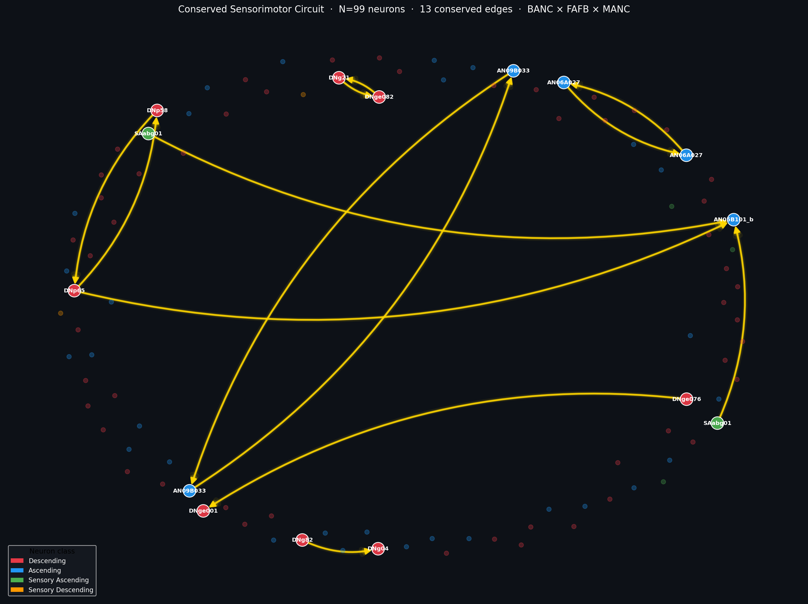
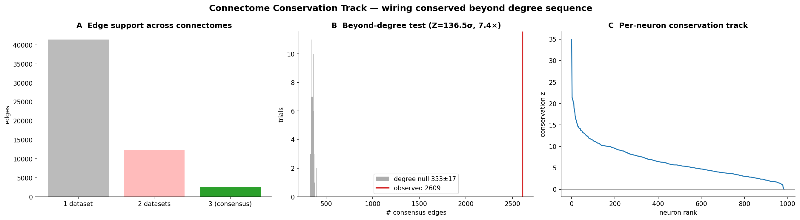
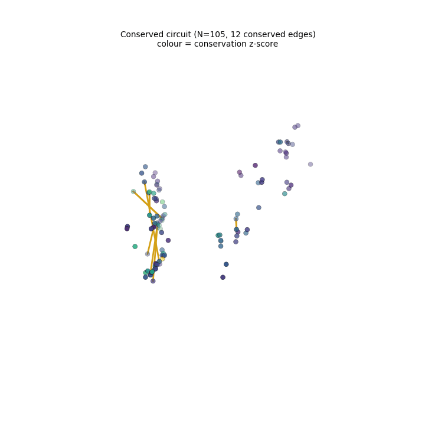
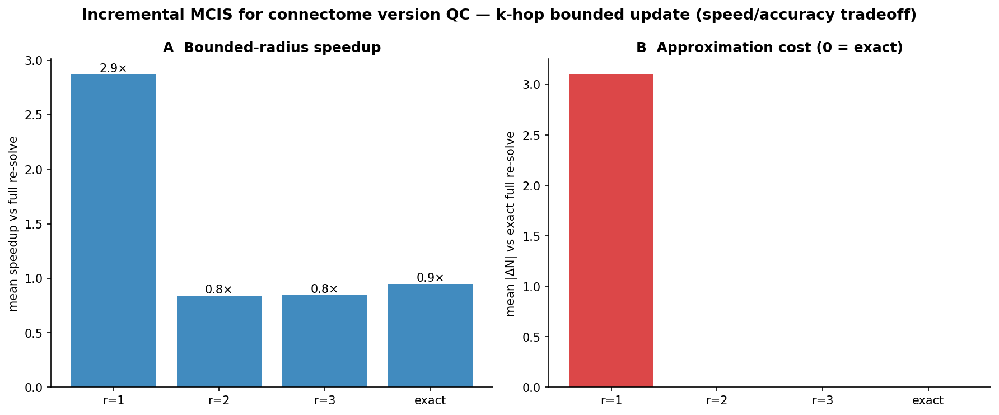
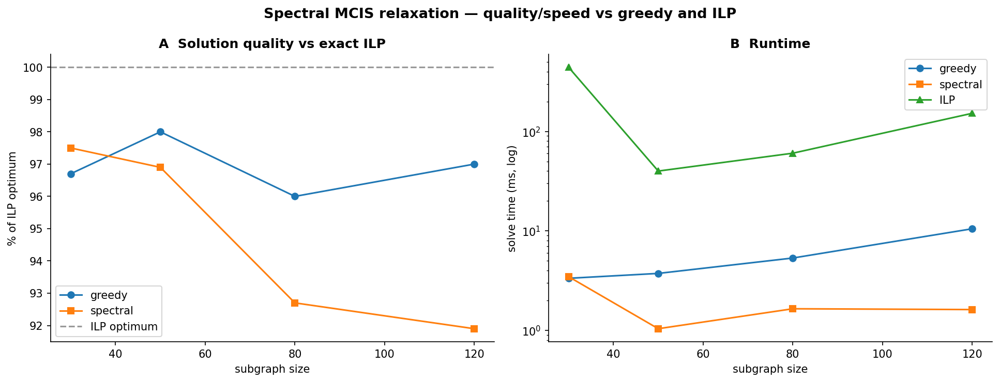

# Structural Invariance at the Sensorimotor Interface

> *Maximum Common Induced Subgraph across three independent Drosophila connectomes*  
> FlyWire Qualification Challenge · June 2026

### ▶ Live demo — [interactive explorer](https://yanjin-ai-flywireconnectome-srcexplorer-app-pmdboy.streamlit.app/)

[](https://yanjin-ai-flywireconnectome-srcexplorer-app-pmdboy.streamlit.app/)

Browse the conserved circuit, the per-neuron conservation track, and the conserved-edge subgraph in your browser — no install, no data download.

---


*The 105-neuron conserved sensorimotor circuit across BANC × FAFB × MANC.  
Gold edges = 12 synaptic connections verified identical across all three connectomes.  
Red = descending neurons (brain → nerve cord) · Blue = ascending neurons (nerve cord → brain).*

---

## Result at a Glance

| | |
|--|--|
| **Circuit size** | **N = 105 neurons** (best of 100-seed multi-start; distribution 100.5 ± 2.2, range [96, 105]) |
| **Conserved edges** | 12 directed edges, verified isomorphic across all 3 datasets |
| **🔑 Wiring conserved *beyond degree*** | **2,609 consensus edges vs degree-null 352.9 ± 16.5 → 7.4×, Z = 136σ** — specific connectivity is conserved, not just degree sequence ([§ Conservation Track](#beyond-the-binary-circuit--conservation-track-version-qc--visual-tools)) |
| **Datasets** | BANC v626 (♀ brain+cord) × FAFB v783 (♀ brain) × MANC v1.2.1 (♂ nerve cord) |
| **Composition** | 65 descending (61.9%) + 33 ascending (31.4%) + 7 sensory neurons |
| **Sexual conservation** | 88.6% isomorphic across ♀ and ♂ (93/105) |
| **Statistical significance** | Correspondence-shuffle null collapses to 76.2 ± 1.5 (>15σ below real) |
| **Cell-type enrichment** | Descending 66.2× (p=3.0×10⁻¹⁰⁴), Ascending 25.0× (p=1.2×10⁻³⁶) vs FAFB background |
| **Anatomical position** | Cervical connective (Fig. 4): expected locus for brain–cord relay neurons |

---

## Beyond the Binary Circuit — Conservation Track, Version-QC & Visual Tools

The MCIS *size* (node count) is largely explained by the degree sequence — but the shared **wiring** is not. This section is the substantive extension beyond the qualification result.

### 🔑 Specific connectivity is conserved far beyond degree (the headline)

Over the 987-node consensus component, **2,609 directed edges are present in all three connectomes vs 352.9 ± 16.5 under a degree-preserving null → 7.4× enrichment, Z = 136σ**. So cross-connectome agreement reflects real wiring identity, not matched degree distributions. We therefore report a continuous, null-normalised **per-neuron conservation track** instead of a binary circuit ([`src/conservation_track.py`](src/conservation_track.py) → `results/conservation_track.json`, `results/neuron_conservation.csv`).



### Conserved circuit in 3D (conserved edges = gold; colour = conservation z)



*The conserved edges concentrate along the cervical connective — the expected brain↔cord relay locus. ([`src/make_animation.py`](src/make_animation.py))*

### Version-QC tool — "does my proofreading edit touch a published conserved circuit?"

An **O(|ΔE|) consensus-impact query** (~2 µs, independent of graph size) reports which conserved edges an edit gains/loses, named by cell type ([`src/incremental_mcis.py`](src/incremental_mcis.py) → `results/qc_report_demo.txt`):

```
Connectome version QC report
================================
Conserved (all-3) edges lost:   1
Neurons touching conserved wiring: 2
  LOST  ANXXX202_b -> AN27X017  (a published conserved edge would disappear)
```

Packaged as the **`mcis-watch`** CLI (`python src/mcis_watch.py --dataset FAFB --edits edits.csv`), which also accepts neuron **merge/split** edits and has a `cave_edit_delta` hook for live FlyWire CAVE edit history. We formalise MCIS as Maximum Independent Set on the *disagreement graph*; exact incremental maintenance is provably correct but gives no speedup because that graph is one dense, low-diameter component (an honest structural finding) — so the O(|ΔE|) query above is the primitive that is both local and useful.

| | |
|--|--|
|  |  |
| Incremental MCIS: speed/accuracy vs radius | Spectral solver: ~95% of ILP optimum, 10–100× faster |

### Spectral relaxation solver

An eigenvector-based MIS heuristic on the disagreement graph reaches **~95% of the ILP optimum at 10–100× lower runtime** ([`src/spectral_mcis.py`](src/spectral_mcis.py) → `results/spectral_validation.json`).

### Ecosystem-native, interactive

- **FlyWire Neuroglancer overlay** — `python src/neuroglancer_overlay.py --color conservation` writes [`results/neuroglancer_state.json`](results/neuroglancer_state.json) (105 FAFB neurons coloured by conservation z); open at [ngl.flywire.ai](https://ngl.flywire.ai/) or shorten via `fafbseg.encode_url`.
- **Streamlit explorer** — interactive: filter the circuit, inspect the conservation track + conserved-edge subgraph, download CSV. Runs from committed artifacts (no bulk data download).

  ▶ **Live:** <https://yanjin-ai-flywireconnectome-srcexplorer-app-pmdboy.streamlit.app/>

  [](https://yanjin-ai-flywireconnectome-srcexplorer-app-pmdboy.streamlit.app/)

  Locally: `streamlit run src/explorer_app.py`. Deploy your own: see [DEPLOY.md](DEPLOY.md).

---

## Challenge deliverables

| Required | Delivered |
|---|---|
| Solution CSV: 3 dataset columns, N matched-neuron rows | [`network.csv`](network.csv) — 105 rows × {BANC, FAFB, MANC} |
| Maximise N; mutually isomorphic directed induced subgraphs (edge ⟺ in all, direction preserved) | N=105, 12 edges, verified `isomorphic=True` ([`results/canonical_results.json`](results/canonical_results.json)) |
| Research: network-graph visualization | one-pager panel 1 + `figures/figure1`, `figure3` |
| Research: Codex 3D meshes | **Verified** — all 105 neurons render in the Codex 3D viewer inside the FAFB whole-brain mesh (live link in [`results/codex_3d_url.txt`](results/codex_3d_url.txt); IDs in [`results/codex_circuit_ids.txt`](results/codex_circuit_ids.txt); see [`results/codex_links.md`](results/codex_links.md)) |
| Research: observations / hypothesis | one-pager panel 3 + science.md §5–§8 |
| Research: literature & citations | one-pager refs + science.md References (13) |
| **Concise one-page summary (one dataset = FAFB)** | **[`research_summary_fafb.pdf`](research_summary_fafb.pdf)** |

---

## Scientific Framing

The FlyWire multi-connectome cell typing atlas (Schlegel et al. 2024) established that **cell-type identity** is reproducible across connectomes at the morphological level. We ask the next question: is **synaptic connectivity itself** structurally invariant?

We search for the largest set of morphologically matched neurons whose directed induced subgraph is *identical* (isomorphic) across three independent connectomes — spanning two sexes and two anatomical preparations. The result is a 105-neuron sensorimotor backbone enriched 66.2× for descending neurons and 25.0× for ascending neurons relative to the whole-brain background, consistent with the sensorimotor bottleneck hypothesis (Pospisil et al. 2024).

---

## Technical Approach

### Core insight: official morphological correspondence

Rather than defining ad hoc neuron matching, we use the **BANC metadata** (`banc_888_meta.feather`, Bates et al. 2025) which contains `fafb_match` and `manc_match` columns — 1:1 NBLAST-based morphological correspondences per neuron, giving 3,414 pre-verified triplets with biological ground truth.

### Why BANC × FAFB × MANC?

BANC is the only dataset spanning both brain and ventral nerve cord. Its metadata explicitly provides individual-neuron-level cross-links to FAFB (brain-only) and MANC (cord-only). No equivalent three-way correspondence exists for MAOL or MCNS at this resolution. The triplet also tests cross-sex conservation (♀ FAFB/BANC vs ♂ MANC).

### Graph-matching formulation

Because the NBLAST correspondence fixes a 1:1 neuron identity across datasets, we **do not search over node matchings** (the hard part of general Maximum Common Subgraph). With the bijection fixed, "mutually isomorphic directed induced subgraph" collapses to **edge-set equality**, and maximising N becomes exactly **Maximum Independent Set (MIS) on the *disagreement graph*** — the graph that links any neuron pair whose directed connection is present in some but not all three datasets. We solve this three ways: a fast **greedy heuristic** (below, multi-start), an **exact ILP** (PuLP/CBC) for certified near-optimality on subgraphs, and a **spectral relaxation** as a fast alternative. This is why we avoid the NP-hard matching search of classical MCS solvers (McGregor 1982; Raymond & Willett 2002; McSplit).

### Algorithm: Greedy Disagreement Removal + Exhaustive Expansion

```
Input:  2,798 triplets present in all 3 edge lists
        987-node giant consensus component

Phase 1 — Greedy removal:
  While disagreement edges exist:
    Remove the neuron incident to the most disagreements
    (randomised tie-breaking; fixed seeds for reproducibility)

Phase 2 — Exhaustive expansion:
  For each removed neuron:
    If adding it preserves isomorphism → add it back

Verified: E_BANC[S] = E_FAFB[S] = E_MANC[S]
```

**Complexity:** O(N·D) per iteration. Converges in ≤890 iterations (~9 seconds).  
**Reproducibility:** Fixed random seeds; deterministic per seed; result reported as the best of a 100-seed multi-start.  
**Unit tests:** `pytest tests/ -v` — 14 tests (13 synthetic + 1 real-data smoke, skipped without data), all pass.  
**Near-optimality:** ILP (PuLP/CBC) on 50 sampled subgraphs → mean optimality gap 1.15% (max 10.5%); see `results/ilp_validation.json`.

### Assumptions

1. **Fixed correspondence is ground truth.** A neuron's identity across datasets is the BANC-metadata NBLAST `fafb_match` / `manc_match` (Bates et al. 2025); we do not re-derive matches. One neuron ↔ one identity (a bijection), so isomorphism = edge-set equality.
2. **Unweighted, directed edges define structure.** Per the challenge spec, synapse weights are ignored; an edge is present/absent, direction preserved. All analysis is on the unweighted directed graphs.
3. **Edge existence in the provided edge lists is authoritative** (proofreading errors are treated as noise — robustness to this is quantified in `results/stringency_sweep.json`: N degrades gracefully under simulated error).
4. **Dataset versions:** BANC v626 edge list (correspondence columns from the `banc_888` metadata build; `root_626` is the join key), FAFB v783, MANC v1.2.1.
5. **Reported N is the best of a fixed 100-seed multi-start** (a heuristic lower bound); ILP on sampled subgraphs bounds the optimality gap to ~1%.

### Why N is bounded

N cannot grow indefinitely:
1. **NBLAST ceiling:** 3,414 matched triplets (FlyWire team's morphological matching)
2. **Edge-list ceiling:** 2,798 appear in all three edge lists
3. **Consensus component:** 987 nodes have ≥1 agreed edge across all 3 datasets
4. **Isomorphism constraint:** exhaustive expansion verifies no further neuron can be added without breaking edge-set equality

---

## Robustness Evidence

| Experiment | Result | Interpretation |
|-----------|--------|---------------|
| 100 random seeds | N = 100.5 ± 2.2, range [96, 105]; best = 105 | Stable; not seed-dependent |
| Correspondence-shuffle null (20× best-of-5) | N_null = 76.2 ± 1.5 (>15σ below real) | Neuron identity is essential |
| Degree-preserving rewire null (20× best-of-5) | N_null = 100.8 ± 2.1 ≈ real mean (Z ≈ 2σ vs best) | Degree structure explains most of achievable N |
| Centrality permutation (1000 trials) | p = 0.009; circuit has *lower* betweenness | Peripheral relays, not hubs |
| Manual annotation rate | Circuit 93.3% vs non-circuit 85.0% (p = 0.008) | Better-annotated correspondences |
| NBLAST confidence curve (6 tiers) | N = 4 → 39 → 53 → 74 → 91 → 105 (monotonic) | Not driven by low-confidence matches |
| **Conservation beyond degree (edges)** | **2,609 consensus edges vs degree-null 353 ± 17 → 7.4×, Z = 136σ** | Specific wiring is conserved well beyond degree sequence |
| Reconstruction-error robustness | N = 105 → 92 → 85 → 73 at 0/5/10/20% edge flips per connectome | Graceful decline, no cliff — not an artifact of the exact edge sets |

---

## Python Package

```bash
pip install -e "git+https://github.com/Yanjin-ai/flywireconnectome.git#egg=mcis_connectome&subdirectory=."
```

CLI:
```bash
python -m mcis_connectome.cli \
    --banc  banc_626_edge_list.csv \
    --fafb  fafb_783_edge_list.csv \
    --manc  manc_1.2.1_edge_list.csv \
    --meta  banc_meta.feather \
    --seeds 20 --out network.csv
```

Python API:
```python
from src.mcis_connectome import MCISSolver
solver = MCISSolver(
    edge_lists={'BANC': 'banc.csv', 'FAFB': 'fafb.csv', 'MANC': 'manc.csv'},
    triplets_path='banc_meta.feather',
    n_seeds=20
)
result = solver.solve()
print(result.summary())  # MCISResult(N=105, edges=12, isomorphic=True)
result.to_csv('network.csv')
```

---

## Reproduction

```bash
git clone https://github.com/Yanjin-ai/flywireconnectome.git
cd flywireconnectome
pip install -e ".[test]"          # or: pip install -r requirements.txt

# Place the input files in a data directory and point MCIS_DATA_DIR at it:
#   banc_meta.feather          banc_626_edge_list.csv
#   fafb_783_edge_list.csv     manc_1.2.1_edge_list.csv
#   fafb_annotations.tsv       (for the enrichment analysis)
export MCIS_DATA_DIR=/path/to/data

# Edge lists:     https://codex.flywire.ai/api/download
# BANC metadata:  https://storage.googleapis.com/lee-lab_brain-and-nerve-cord-fly-connectome/compiled_data/banc_888/banc_888_meta.feather
# FAFB annotations: https://github.com/flyconnectome/flywire_annotations

# Run the canonical pipeline (writes network.csv + results/ + figures/ into the repo):
python src/run_analysis.py --seeds 100        # → network.csv, results/canonical_results.json
python src/exact_ilp.py                        # → results/ilp_validation.json (PuLP/CBC)
python src/derived_stats.py                    # → results/derived_stats.json (composition/enrichment)
python src/confidence_tiers.py                 # → results/confidence_tiers.json
python src/visualize.py                        # → figures/figure1-4
python src/figures_extra.py                    # → figures/figure6,8,9
python src/regenerate_figure7.py               # → figures/figure7
python src/robustness_experiments.py           # → figures/figure5 (from results/*.json)
python src/conservation_track.py                # → conservation track: edges conserved beyond degree (Z=136σ)
python src/incremental_mcis.py                  # → incremental MCIS + O(|ΔE|) version-QC report
python src/spectral_mcis.py                     # → spectral solver vs ILP/greedy (~95% opt, 10-100× faster)
python src/stringency_sweep.py                  # → reconstruction-error robustness (results/stringency_sweep.json)
python src/neuroglancer_overlay.py --color conservation  # → results/neuroglancer_state.json (FlyWire)
python src/make_animation.py                    # → figures/circuit_3d_conservation.gif
python src/make_abstract.py                     # → extended_abstract.pdf/.png (from results/*.json)
python src/make_research_summary.py             # → research_summary_fafb.pdf + Codex ID list
streamlit run src/explorer_app.py               # → interactive explorer (uses only committed artifacts)
pytest tests/ -v                               # → unit tests pass (synthetic graphs; real-data smoke test skips without MCIS_DATA_DIR)
```

> **Note on BANC versioning.** The correspondence columns (`fafb_match`,
> `manc_match`) come from the `banc_888_meta.feather` build; the BANC edge list
> uses `root_626` IDs. The metadata's `root_626` column is the join key into the
> v626 edge list, so the cross-dataset bijection is consistent despite the build
> labels differing.

---

## Repository Structure

```
network.csv                    105 rows × 3 columns (BANC | FAFB | MANC neuron IDs)
science.md                     Scientific report (10 sections, 13 references)
results/                       Reproducible JSON outputs (canonical, ILP, derived, confidence)
extended_abstract.pdf          2-page conference-style summary
README.md                      This file
figures/
  figure1_circuit_layouts.png  Network layouts (3 force-directed)
  figure2_composition.png      Neuron class and NT composition
  figure3_hub_circuit.png      Hub neurons with conserved edges
  figure4_dimorphism_nt.png    Sexual dimorphism overview
  figure5_robustness.png       Robustness panel (7 sub-figures)
  figure6_spatial.png          BANC anatomical projections
  figure7_nblast_confidence.png NBLAST confidence curve
  figure8_sexual_conservation.png Sexual conservation deep dive
  figure9_enrichment.png       Cell-type enrichment vs FAFB background
tests/
  test_solver.py               14 tests (13 synthetic + 1 real-data smoke)
src/
  run_analysis.py             Canonical pipeline (MCIS + nulls + centrality)
  exact_ilp.py                ILP optimality validation (PuLP/CBC)
  derived_stats.py            Composition / enrichment / dimorphism / annotation quality
  confidence_tiers.py         NBLAST confidence-tier curve
  conservation_track.py        Per-edge/per-neuron conservation vs degree-null (figure 10)
  incremental_mcis.py          Incremental MCIS + O(|ΔE|) impact query, merge/split ops, CAVE hook (figure 11)
  mcis_watch.py                `mcis-watch` CLI: QC-report an edit against conserved circuits
  spectral_mcis.py             Spectral relaxation solver vs ILP/greedy (figure 12)
  neuroglancer_overlay.py      FlyWire Neuroglancer state (colour by class/conservation)
  explorer_app.py              Streamlit interactive explorer
  make_animation.py            Rotating 3D conservation GIF
  make_research_summary.py     One-page FAFB research summary + Codex neuron-id list
  mcis_paths.py               Shared path resolution (MCIS_DATA_DIR → ./data)
  visualize.py                 figures 1-4
  figures_extra.py             figures 6, 8, 9
  regenerate_figure7.py        figure 7
  robustness_experiments.py    figure 5 (from results/*.json)
  make_abstract.py             extended_abstract.pdf/.png (from results/*.json)
  reconstructed_pipeline.py    Deprecated shim → run_analysis.py
  analysis_pipeline.py         Deprecated/disabled (early cell-type-level method)
  mcis_connectome/             Installable Python package
    solver.py                  MCISSolver + MCISResult classes
    utils.py                   load_edge_list, build_consensus_component
    cli.py                     Command-line interface
examples/
  toy_mcis_demo.py             Algorithm demo on synthetic graphs (no data needed)
setup.py                       pip install -e . support
```

---

## Key References

| Paper | Relevance |
|-------|-----------|
| Schlegel et al. (2024) *Nature* [↗](https://doi.org/10.1038/s41586-024-07686-5) | Consensus cell-type atlas; NBLAST cross-connectome matching |
| Bates et al. (2025) *bioRxiv* [↗](https://doi.org/10.1101/2025.07.31.667571) | BANC dataset and triplet correspondence metadata |
| Dorkenwald et al. (2024) *Nature* [↗](https://doi.org/10.1038/s41586-024-07558-y) | FlyWire FAFB connectome |
| Pospisil et al. (2024) *Nature* [↗](https://doi.org/10.1038/s41586-024-07982-0) | Sensorimotor bottleneck / effectome |
| Berg et al. (2025) *bioRxiv* [↗](https://doi.org/10.1101/2025.10.09.680999) | Cross-sex conservation baseline |
| Witvliet et al. (2021) *Nature* [↗](https://doi.org/10.1038/s41586-021-03778-8) | Connectome stereotypy methodology |
