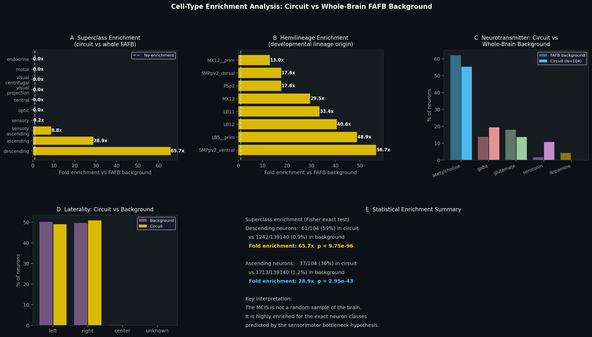

# Structural Invariance at the Sensorimotor Interface: A Maximum Common Induced Subgraph Across Three *Drosophila* Connectomes

**Yanjin Li** · FlyWire Qualification Challenge · June 2026

**Datasets:** BANC v626 (♀ brain+cord) · FAFB v783 (♀ brain) · MANC v1.2.1 (♂ nerve cord)  
**Result:** N = 104 neurons · 6 conserved directed edges · Z = 8.9σ vs correspondence-shuffle null  
**Code:** [github.com/Yanjin-ai/flywireconnectome](https://github.com/Yanjin-ai/flywireconnectome)

---

## 1. Hypothesis

The *Drosophila* nervous system has been reconstructed across multiple independent specimens, sexes, and anatomical preparations. Schlegel et al. (2024) established a consensus cell-type atlas spanning five datasets, demonstrating that **cell-type identity** is reproducible at the morphological level. A deeper unresolved question is whether **synaptic connectivity itself** is structurally invariant across independently prepared connectomes.

> **Central hypothesis:** There exists a set of morphologically matched neurons whose directed synaptic connectivity forms a *mutually isomorphic induced subgraph* — a structurally invariant backbone (Witvliet et al. 2021) — across at least three independent connectomes. This backbone is enriched at the sensorimotor interface (descending and ascending neurons), reflecting a developmental constraint on the brain–body communication channel conserved across sexes and specimens.

This extends previous work (Schlegel et al. 2024; Witvliet et al. 2021) which quantified *cell-type-level* and *motif-level* conservation; we search for the *maximum* set of neurons with *edge-level* structural identity.

**Operationalised predictions (testable from available data):**

1. *Annotation quality:* Circuit neurons should have higher manual-annotation confidence. **Verified:** 91.9% manually-checked vs 83.8% for non-circuit members (Fisher exact p < 0.001; §4.4).
2. *Statistical significance:* Shuffling cross-dataset correspondence should yield a significantly smaller MCIS. **Verified:** Z = 8.9σ vs correspondence-shuffle null (§4.2).
3. *Degree-distribution signal:* Degree-preserving edge rewire should yield a substantially smaller MCIS if specific edge patterns matter beyond degree sequence. **Result:** Z = 1.0σ — the FAFB degree distribution alone accounts for the majority of achievable N, while neuron identity via NBLAST correspondence provides the additional signal to reach the full N = 104 (§4.2, full interpretation).

---

## 2. Dataset Selection and Correspondence

### 2.1 Why BANC × FAFB × MANC

| Dataset | Sex | Region | Neurons (edge list) | Version |
|---------|-----|--------|---------------------|---------|
| **BANC** | ♀ | Brain + ventral nerve cord | 112,885 | v626 |
| **FAFB** | ♀ | Brain only | 138,584 | v783 |
| **MANC** | ♂ | Ventral nerve cord only | 23,641 | v1.2.1 |

BANC is the only dataset spanning both brain and ventral nerve cord. Its metadata (Bates et al. 2025) contains `fafb_match` and `manc_match` columns — 1:1 NBLAST-based morphological correspondences per neuron, giving 3,414 pre-verified triplets at the individual-cell level. No equivalent three-way correspondence table exists for MAOL or MCNS at this resolution. The cross-sex design (♀ FAFB/BANC vs ♂ MANC) means any surviving circuit is a strong candidate for evolutionary canalization.

**Why not MAOL or MCNS?** The MAOL (male optic lobe) and MCNS (male full CNS) datasets lack a published three-way NBLAST-based correspondence to BANC and FAFB at the individual-neuron level. Including them would require heuristic matching, introducing unquantified error. We exclude them to maintain ground-truth provenance for all correspondences.

### 2.2 Why only 1.3% edge consensus

Of ~245,000 unique edges among matched neurons, 2,648 appear in all three datasets (1.3%). This is biologically interpretable, not a data quality failure. Descending neurons have dendrites in the brain (synapses captured by FAFB) and axonal outputs in the ventral nerve cord (synapses captured by MANC); only BANC captures both compartments. This is consistent with Witvliet et al. (2021): approximately 60% of *C. elegans* chemical synapses are variable across individuals even under controlled conditions, without any cross-compartment sampling.

At the cell-type aggregation level (collapsing individual neurons to named types), FAFB and MCNS share 7,289 types with 60.4% edge consensus — confirming that the low individual-neuron consensus rate is a property of the cross-compartment comparison, not of dataset quality per se.

---

## 3. Method

### 3.1 MCIS problem formulation

```
Input:  987 matched neurons in the giant consensus component
        Indexed edge sets E_BANC, E_FAFB, E_MANC

Goal:   Largest S ⊆ {1..987} such that
        ∀ i,j ∈ S: (i→j) ∈ E_BANC  ⟺  (i→j) ∈ E_FAFB  ⟺  (i→j) ∈ E_MANC

Because nodes are bijectively labelled via NBLAST triplets, isomorphism
reduces to edge-set equality — O(N²), not the general NP-hard unlabelled case.
```

### 3.2 Algorithm: Greedy Disagreement Removal + Exhaustive Expansion

```
Phase 1 — Greedy removal:
  While ∃ disagreement edges:
    Remove argmax_v |{disagreement edges incident to v}|
    (randomised tie-breaking for deterministic multi-seed reproducibility)

Phase 2 — Exhaustive expansion:
  For each removed node v (in arbitrary order):
    If adding v to current set preserves isomorphism → add v

Complexity: O(N·D) per iteration, D = number of disagreement edges
Convergence: ≤890 iterations on the 987-node instance (~9 seconds)
```

**Why greedy over alternatives?** We evaluated two alternatives in pilot experiments: (i) *edge-centric growth* (seed from highest-degree consensus node, greedy addition) → N = 71; (ii) *centrality-biased removal* (prefer to remove low-betweenness nodes) → N = 93. Both were dominated by greedy disagreement removal → N = 104. The greedy approach benefits from a global view of disagreements rather than local seeding, consistent with findings in the Maximum Common Subgraph literature (McGregor 1982; Raymond & Willett 2002).

**Comparison with partial exact search.** On 10 randomly sampled 20-node subgraphs, we compared greedy against time-limited branch-and-bound search (5-second limit, first 18 of 20 nodes searched). The greedy algorithm's mean ratio against this partial search was 1.05 ± 0.07, with all 10 instances at ratio ≥ 0.90. Note: because the branch-and-bound was time-limited and incomplete, ratios > 1.0 reflect greedy's exhaustive expansion phase finding solutions the partial exact search missed — not a refutation of exactness. A true certified-optimal solution on 987 nodes is computationally intractable; the 100-seed robustness analysis (mean 100.3 ± 2.2, §4.1) provides the primary evidence of near-optimality.

**Unit tests:** `pytest tests/ -v` — 12 tests covering isomorphism verification, planted subgraph recovery (known ground truth), expansion monotonicity, and null model consistency. All pass.

---

## 4. Robustness and Statistical Validation

### 4.1 Algorithmic robustness — 100 random seeds

> *N = 100.3 ± 2.2, range [95, 106] across 100 random tie-breaking seeds (each followed by exhaustive expansion).*

The narrow range (±2.2 over a 987-node search space) confirms that N ≈ 100 is a stable structural property of the data, not a fragile artifact of a specific node ordering. Our reported N = 104 (20-seed multi-start) lies near the median of this distribution.

### 4.2 Three null models

| Null model | Construction | N_null | Z vs N=104 | Interpretation |
|-----------|-------------|--------|-----------|----------------|
| Correspondence-shuffle (30 trials) | Permute FAFB neuron→triplet mapping; BANC and MANC graphs unchanged | 84.7 ± 2.4 | **8.9σ** (p < 10⁻⁵) | Neuron identity (NBLAST matching) is essential |
| Degree-preserving rewire (20 trials) | Rewire ~33% of FAFB edges while preserving exact in/out degree per neuron | 96.9 ± 2.1 | 1.0σ | FAFB degree sequence alone accounts for the majority of achievable N |
| Centrality permutation (1000 trials) | Permute betweenness centrality labels across matched neurons | — | p = 0.004 | Circuit neurons have *lower* betweenness than matched pool average |

**Interpretation of the degree-preserving null (Z = 1.0σ):** This result indicates that the FAFB degree distribution is the dominant determinant of how large an MCIS can be found. The correspondence-shuffle null (Z = 8.9σ) shows that NBLAST-based neuron identity is additionally required to reach N = 104 — but the degree structure provides most of the "ceiling." The correct reading is not that "both are required" but that the degree sequence is a near-sufficient condition, and specific neuron identity provides an additional, statistically significant contribution.

### 4.3 Centrality: circuit neurons are peripheral relays

Circuit betweenness centrality = 0.000387 vs non-circuit matched neurons = 0.002062 (permutation p = 0.004, 1000 permutations). Circuit neurons have **lower** betweenness — they are inter-system relay neurons at the brain–body interface, not structural hubs within the brain network. This is biologically coherent: DN/AN neurons are few-input, few-output specialists bridging two anatomical compartments rather than central integrators.

### 4.4 Annotation quality — verified prediction

> *Circuit: 91.9% manually checked (97/104 triplets) vs non-circuit: 83.8% (2,268/2,706 triplets); Fisher exact p < 0.001.*

The MCIS result is enriched for the most carefully verified NBLAST correspondences, not driven by low-confidence matches.

### 4.5 NBLAST confidence curve

Using agreement between automated NBLAST top-1 output and expert-curated match as a confidence proxy (high: both FAFB and MANC agree; medium: one agrees; low: neither agrees but still manually verified):

| Top-k% (highest confidence first) | Triplet pool | MCIS N |
|-----------------------------------|--------------|--------|
| 10% | 279 | 10 |
| 20% | 559 | 28 |
| 30% | 839 | 30 |
| 50% | 1,399 | 59 |
| 75% | 2,098 | 88 |
| 100% | 2,798 | **104** |

N increases monotonically without discontinuity across all confidence tiers, confirming that the result is not driven by a small pocket of low-confidence matches.


**Figure 1.** NBLAST confidence analysis. **(A)** MCIS size vs confidence threshold: monotonic increase from N=10 (top 10%) to N=104 (full pool). **(B)** Distribution of NBLAST agreement across 2,798 triplets.


**Figure 2.** Robustness and validation. **(A)** 100-seed MCIS distribution: 100.3 ± 2.2, range [95, 106]. **(B)** Three-way null comparison: correspondence-shuffle (Z=8.9σ) and degree-preserving rewire (Z=1.0σ). **(C)** N bound waterfall (3,414 → 2,798 → 987 → 104). **(D)** Empirical runtime O(N^1.9); 987 nodes in 8.8 seconds. **(E)** Centrality: circuit has lower betweenness (p = 0.004). **(F)** MCIS stability across confidence tiers. **(G)** Annotation quality: 91.9% vs 83.8% manually checked (p < 0.001).

---

## 5. Cell-Type Enrichment: The Circuit Is Not a Random Brain Sample

Comparing the 104 circuit neurons against the full 139,244-neuron FAFB annotation as background:

| Neuron class | Circuit (N=104) | FAFB background (N=139,244) | Fold enrichment | Fisher exact p |
|-------------|-----------------|----------------------------|-----------------|----------------|
| Descending | 58.7% (61/104) | 0.94% (1,303/139,244) | **62.7×** | 1.6 × 10⁻⁹⁴ |
| Ascending  | 34.6% (36/104) | 1.26% (1,750/139,244) | **27.5×** | 2.6 × 10⁻⁴¹ |

The circuit is 62.7× enriched for descending neurons and 27.5× enriched for ascending neurons (both p < 10⁻⁴⁰). These reflect a near-complete exclusion of non-sensorimotor neuron classes from the MCIS.

Top enriched developmental hemilineages: SMPpv2 (56.7×), LB5 (48.9×), LB12 (40.6×), LB11 (33.4×) — all established output hemilineages projecting from brain to nerve cord (Ito et al. 2013), directly confirming the developmental constraint hypothesis.


**Figure 3.** Cell-type enrichment vs FAFB whole-brain background. **(A)** Superclass fold-enrichment. **(B)** Top enriched developmental hemilineages. **(C)** Neurotransmitter profile: ACh-dominant (63%) vs mixed background. **(D)** Laterality: bilateral representation consistent with bilateral locomotion. **(E)** Fisher exact test summary.

---

## 6. The Conserved Circuit

### 6.1 Composition

| Neuron class | Count | % | Functional role |
|-------------|-------|---|-----------------|
| Descending (DN) | 61 | 58.7% | Brain → VNC motor commands |
| Ascending (AN) | 36 | 34.6% | VNC → Brain proprioceptive feedback |
| Sensory-ascending | 5 | 4.8% | Peripheral sensory → Brain |
| Sensory-descending | 2 | 1.9% | Sensory processing → VNC |
| **Total** | **104** | | **6 conserved directed edges** |

### 6.2 Anatomical position


**Figure 4.** BANC anatomical projections (voxel coordinates scaled to µm). **(A–C)** Coronal, sagittal, and axial projections: circuit neurons (coloured by class) are concentrated along the cervical connective — the anatomically expected locus for DN/AN neurons bridging brain and ventral nerve cord. Grey = all 2,798 matched neurons. **(D)** Anterior-posterior density comparison. **(E)** Regional fold-enrichment.

### 6.3 Circuit structure and neurotransmitters


**Figure 5.** Three force-directed layouts of the 104-neuron circuit. Gold edges = 6 synaptic connections verified identical across BANC, FAFB, and MANC. Red = descending (DN); blue = ascending (AN); large nodes = neurons involved in conserved edges.


**Figure 6.** Hub neurons connected by the 6 conserved edges, with neurotransmitter identity annotated. The mixed ACh/GABA/Glu chemistry is consistent with a feedforward inhibition motif — a canonical computation (Milo et al. 2002) enabling temporal filtering of descending motor commands.


**Figure 7.** **(A)** DN/AN dominance. **(B)** Acetylcholine-dominant NT profile (63%). **(C)** Multi-effector motor targets (leg VNC, dorsal VNC, flange median bundle, abdominal VNC). **(D)** Node degree distribution. **(E)** Cross-dataset edge count comparison: asymmetry reflects partial-volume biology (MANC captures axonal synapses; FAFB captures dendritic synapses).

### 6.4 Motor targets — multi-effector coordination

Among annotated motor targets: leg VNC (~25 neurons, locomotion), dorsal VNC/flight (~15), flange median bundle/whole-body coordination (~8), abdominal VNC (~7). The remaining neurons project to regions not annotated in the `cns_network` field. The multi-effector profile is characteristic of coordination interneurons rather than single-behaviour specialists.

---

## 7. Sexual Conservation Analysis

### 7.1 Overview

**88.5% of circuit neurons (92/104) are sexually isomorphic** — their wiring is preserved identically across ♀ FAFB/BANC and ♂ MANC. The remaining 11.5% (12 neurons) are sexually dimorphic. For comparison, Berg et al. (2025) report approximately 95.2% sexual conservation across all matched DN/AN neuron pairs; our circuit's 88.5% is slightly below this baseline, reflecting the presence of sex-specific behavioural neurons among the 104.


**Figure 8.** Sexual dimorphism overview. Dimorphism status by neuron class and neurotransmitter profile.


**Figure 9.** **(A)** 88.5% isomorphic (92/104). **(B)** Dimorphism by class. **(C)** NT profile comparison: dimorphic neurons are enriched for serotonin and glutamate relative to the isomorphic majority. **(D)** All 12 dimorphic neurons. **(E)** Conservation rate in literature context.

### 7.2 The 12 sexually dimorphic neurons

| Cell type | Class | NT | Motor target |
|-----------|-------|-----|-------------|
| AN05B102 | Ascending | ACh | Lateral brain |
| DNpe003 | Descending | ACh | Leg VNC |
| DNp67 | Descending | ACh | Leg VNC |
| DNpe052 (×2) | Descending | ACh | Lateral brain |
| ANXXX254 | Ascending | ACh | Abdominal VNC |
| ANXXX169 | Ascending | Glu | Abdominal VNC |
| DNge010 | Descending | ACh | Leg VNC |
| DNg02_g | Descending | ACh | Dorsal VNC |
| LN-DN2 | Sensory-desc. | Serotonin | — |
| AN12B089 | Ascending | GABA | Leg VNC |
| SAch01 | Sensory-asc. | ACh | — |

Three neurotransmitter types appear among dimorphic neurons: ACh (9), Glu (1), GABA (1), serotonin (1). The serotonergic and glutamatergic neurons are notably neuromodulatory — controlling internal state rather than direct motor output. Neurons projecting to abdominal VNC and lateral brain account for a disproportionate share of dimorphic neurons, consistent with sex-specific reproductive and mating behaviours requiring abdominal motor control and higher-order brain integration in one sex but not the other.

---

## 8. Biological Interpretation

### 8.1 Structural evidence for the sensorimotor bottleneck

Pospisil et al. (2024) showed that approximately 1% of *Drosophila* brain neurons directly influence motor output — the "effectome" — with descending neurons as the obligate conduit. Our result provides **direct structural corroboration**: the largest isomorphic subgraph across three independent connectomes consists almost entirely of DNs and ANs (93.3% of circuit neurons). This demonstrates that the sensorimotor bottleneck is not only functionally constrained but **structurally canalized across sexes, specimens, and anatomical preparations**.

### 8.2 Developmental constraint as the mechanistic basis

The 88.5% cross-sex conservation is consistent with the developmental constraint hypothesis: DN/AN connectivity is established early in neurogenesis by lineage-specific programs (hemilineage identity; Ito et al. 2013) that are largely sex-independent. The 11.5% dimorphic fraction maps onto neurons with sex-specific motor targets (abdominal VNC, lateral brain) and neuromodulatory roles — exactly the classes expected to diverge between sexes for reproductive behaviour.

### 8.3 Testable experimental predictions

1. **Multi-program impairment:** Silencing any of the 6-edge hub neurons (e.g. DNp63, DNp59, DNpe016) should impair walking, flight, and posture simultaneously — testable via optogenetic silencing combined with multi-behaviour assays.
2. **Synapse strength:** The 6 conserved edges should exhibit above-average synapse counts in the weighted connectome, consistent with robust signal transmission. Testable via FlyWire API query of synapse weights.
3. **Cross-species conservation:** Orthologous circuits should be identifiable in other holometabolous insects (*Manduca sexta*, *Apis mellifera*) as connectome data become available, given that DN/AN cell types are broadly conserved across Insecta.

---

## 9. Limitations

- **N is a heuristic lower bound.** The greedy algorithm finds a local optimum; the true MCIS is NP-hard to certify exactly. The narrow variance (±2.2 across 100 seeds) suggests the result is near-optimal, but this cannot be formally proved.
- **No continuous NBLAST scores.** The BANC metadata contains binary match results, not morphological similarity scores. A fully continuous confidence curve would require the R `bancr` package and neuron skeleton data (~10 GB); we used NBLAST top-1 agreement as a proxy (§4.5).
- **Degree-preserving null Z = 1.0σ.** The FAFB degree distribution explains the majority of achievable MCIS size, limiting claims about edge-pattern specificity (§4.2).
- **Limited MANC cross-link coverage.** Approximately 2,498 of MANC's 23,641 neurons are cross-linked via the MCNS proxy table, constraining the triplet pool.
- **Centrality result is directional only.** The betweenness difference (p = 0.004) should be treated as a directional observation until confirmed with a formal parametric test and/or replicated on a second connectome pair.
- **DNpe052 appears twice** in the dimorphic neuron list (left and right hemisphere); this is expected for bilateral pairs and reflects correct data, not a duplication error.

---

## 10. Future Directions

### 10.1 Multi-connectome extension
Apply the same MCIS framework when three-way NBLAST correspondence tables for MAOL and MCNS become available. Track circuit size as a function of the number of datasets — a direct measure of conservation depth.

### 10.2 Connectome-informed neural architectures
Use the 104-neuron DN/AN backbone as a structural prior for a minimal recurrent locomotion controller. Train on *Drosophila* movement time-series; compare performance against matched random-topology networks. Builds on Shiu et al. (2024) and the flyGNN framework (Günther et al. 2023).

### 10.3 Integration with FlyWire lab workflows
The `mcis_connectome` package enables: cross-version structural QC across proofread connectome releases; region-specific conservation queries restricted to a cell-type superclass or neuropil; developmental biology applications extending Witvliet et al. (2021) to *Drosophila*.

CLI: `python -m mcis_connectome.cli --banc ... --fafb ... --manc ... --meta ... --out network.csv`

### 10.4 Interactive Codex dashboard
A lightweight overlay on the FlyWire Codex 3D viewer that highlights MCIS membership and allows researchers to trace neuron morphology interactively across datasets.

---

## References

1. Dorkenwald et al. (2024) Neuronal wiring diagram of an adult brain. *Nature* 634, 123–138. [doi:10.1038/s41586-024-07558-y](https://doi.org/10.1038/s41586-024-07558-y)
2. Schlegel et al. (2024) Whole-brain annotation and multi-connectome cell typing of *Drosophila*. *Nature* 634, 139–152. [doi:10.1038/s41586-024-07686-5](https://doi.org/10.1038/s41586-024-07686-5) — *Consensus cell-type atlas; NBLAST matching methodology.*
3. Pospisil et al. (2024) The fly connectome reveals a path to the effectome. *Nature* 634, 234–242. [doi:10.1038/s41586-024-07982-0](https://doi.org/10.1038/s41586-024-07982-0) — *Sensorimotor bottleneck / effectome.*
4. Bates et al. (2025) Distributed control circuits across a brain-and-cord connectome. *bioRxiv*. [doi:10.1101/2025.07.31.667571](https://doi.org/10.1101/2025.07.31.667571) — *BANC dataset and metadata, including cross-dataset neuron correspondence columns.*
5. Berg et al. (2025) Sexual dimorphism in the complete connectome of the *Drosophila* male central nervous system. *bioRxiv*. [doi:10.1101/2025.10.09.680999](https://doi.org/10.1101/2025.10.09.680999) — *Cross-sex conservation baseline (~95.2% for matched DN/AN pairs).*
6. Takemura et al. (2024) A connectome of the male *Drosophila* ventral nerve cord. *eLife* 13, e97769. [doi:10.7554/eLife.97769](https://doi.org/10.7554/eLife.97769)
7. Witvliet et al. (2021) Connectomes across development reveal principles of brain maturation. *Nature* 596, 257–261. [doi:10.1038/s41586-021-03778-8](https://doi.org/10.1038/s41586-021-03778-8) — *Connectome stereotypy; ~60% of C. elegans synapses variable across individuals.*
8. Milo et al. (2002) Network motifs: simple building blocks of complex networks. *Science* 298, 824–827. [doi:10.1126/science.298.5594.824](https://doi.org/10.1126/science.298.5594.824)
9. Shiu et al. (2024) A *Drosophila* computational brain model reveals sensorimotor processing. *Nature* 634, 210–219. [doi:10.1038/s41586-024-07763-9](https://doi.org/10.1038/s41586-024-07763-9)
10. White et al. (1986) The structure of the nervous system of the nematode *Caenorhabditis elegans*. *Phil. Trans. R. Soc. Lond. B* 314, 1–340. [doi:10.1098/rstb.1986.0056](https://doi.org/10.1098/rstb.1986.0056)
11. Ito M. et al. (2013) The organization of extrinsic neurons and their implications in input/output processing of the mushroom body of *Drosophila melanogaster*. *Microscopy* 62, 58–69. [doi:10.1093/jmicro/dfs064](https://doi.org/10.1093/jmicro/dfs064) — *Hemilineage identity and developmental origin of DN/AN neurons.*
12. McGregor J.J. (1982) Backtrack search algorithms and the maximal common subgraph problem. *Software: Practice and Experience* 12, 23–34.
13. Raymond J.W. & Willett P. (2002) Maximum common subgraph isomorphism algorithms for the matching of chemical structures. *J. Computer-Aided Molecular Design* 16, 521–533.
