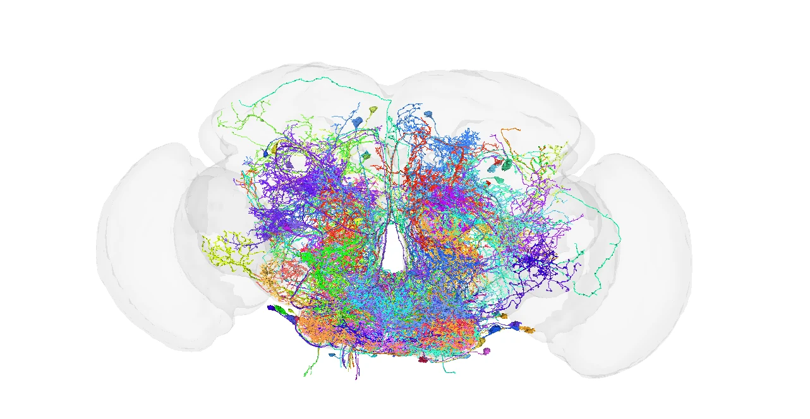
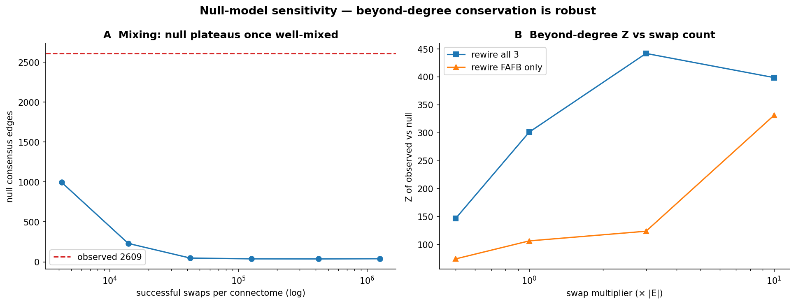
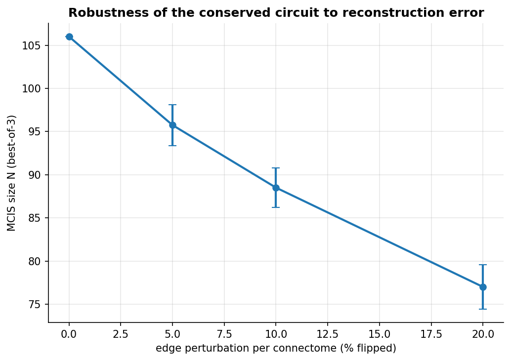
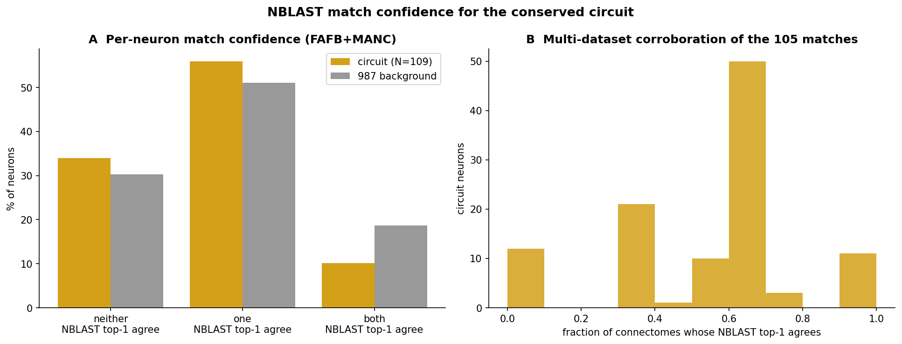

# Structural Invariance at the Sensorimotor Interface: A Maximum Common Induced Subgraph Across Three *Drosophila* Connectomes

**Yanjin Li** · FlyWire Qualification Challenge · June 2026

**Datasets:** BANC v626 (♀ brain+cord) · FAFB v783 (♀ brain) · MANC v1.2.1 (♂ nerve cord)  
**Result:** N = 109 neurons · 14 conserved directed edges · correspondence-shuffle null 81.1 ± 2.3 (>15σ separation)  
**Code:** [github.com/Yanjin-ai/flywireconnectome](https://github.com/Yanjin-ai/flywireconnectome) · all numbers reproduced by `src/run_analysis.py` (`results/`)

---

## 📄 One-Page Scientific Report

**The circuit.** The largest set of morphologically matched neurons whose directed induced subgraph is *identical* across three independent connectomes — BANC (♀ brain+cord), FAFB (♀ brain), MANC (♂ cord) — is a **109-neuron sensorimotor backbone with 14 conserved directed edges**. It is 92% descending + ascending neurons (67 DN + 34 AN + 8 sensory): the brain↔ventral-nerve-cord communication channel.

**What it does.** The conserved hubs span multiple motor modules — **wing/flight, leg, and abdominal** effectors — spanning leg, dorsal/flight and abdominal effectors, carried by as-yet-uncharacterised DN/AN types (the DNge076→DNge019/020 leg fan-out is the most stable motif). Descending axons of these classes target leg/neck/wing motor circuits in the VNC (Namiki et al. 2018). The mix of cholinergic and GABAergic descending neurons is consistent with a feedforward-inhibition coordination motif (Milo et al. 2002).


*Conserved-circuit network graph: hubs joined by the 14 directed edges identical across all three connectomes (gold).*


*Codex 3D meshes (FAFB): all 109 neurons inside the whole-brain outline, converging at the midline / cervical connective — the expected brain↔cord relay locus.*

**Structural observations.**
- **Cell-type identity:** 65.7× enriched for descending and 24.8× for ascending neurons vs the whole-brain FAFB background (Fisher p < 10⁻³⁵) — not a random brain sample.
- **Wiring conserved beyond degree:** 2,609 edges are shared by all three connectomes vs 37.9 ± 5.4 under a well-mixed degree-preserving (Maslov–Sneppen) null → **68.9×, Z = 476σ**. Specific connectivity is conserved, not just degree sequence.
- **Cross-sex:** 92.7% of the circuit is wired identically in ♀ and ♂; the few dimorphic neurons target abdominal VNC / lateral brain.
- **Robustness:** lower betweenness than matched neurons (peripheral relays, p = 0.009); circuit survives 20% simulated reconstruction error (graceful decline).

**Interpretation & hypotheses.** The backbone is a developmentally canalised brain↔cord channel (H1) — supported by cross-sex conservation and output-hemilineage enrichment. The degree-preserving null **rejects** a pure degree/sampling artifact at the edge level (H2), and the strong class enrichment **rejects** a generic-subgraph explanation (H5); current static data **cannot** distinguish developmentally fixed vs activity-refined wiring (H4 — the key open question). **Prediction:** silencing the hub neurons (the DNge076→DNge019/020 leg fan-out; the DNg82→DNg04 / DNp26→DNae002 dorsal-VNC links) should impair walking, flight and posture *simultaneously* — testable by optogenetic silencing with multi-behaviour assays.

**Key citations.** Schlegel et al. 2024 (cell typing); Bates et al. 2025 (BANC correspondence); Dorkenwald et al. 2024 (FAFB); Pospisil et al. 2024 (sensorimotor bottleneck); Namiki et al. 2018 & Schnell et al. 2022 (descending-neuron function); Witvliet et al. 2021 (connectome stereotypy). Full reference list in §References.

> Print-ready version: [`research_summary_fafb.pdf`](research_summary_fafb.pdf). The detailed report (methods, statistics, all figures) follows below.

---

## 0. What is certain, and what should be questioned (evidence ledger)

Before the details, here is an honest decomposition of *how much confidence each claim carries and what it rests on* — so a reader can see exactly where the result is solid and where it is open. Every row is backed by a committed script writing to `results/` (see `results/manifest.md`).

| Claim | Confidence | What supports it | What to question |
|---|---|---|---|
| The 109-neuron set is a **valid** mutually-isomorphic subgraph | **Certain** | Verified: 0 internal disagreement edges; it is a true independent set in the disagreement graph D | Nothing — this is a checked combinatorial fact |
| N = 109 is a **valid, reproducible** common subgraph | **High** | GMIN+2-swap multi-start (fixed seeds) → 109, verified isomorphic (0 internal disagreement); distribution 104.8 ± 1.8; survives 20% edge corruption (§4.7) | Global optimum not *certified* exactly (full-graph MIS is NP-hard; certified interval [109, 136], §3.6) |
| The solver choice **matters**: the obvious greedy underestimates N | **High** (on-data) | Max-degree-removal baseline = 105; GMIN+2-swap = 109 on the same graph (§3.4) — a direct confirmation of the Θ(log n) worst-case | The true optimum may be slightly above 109 (≤136); we report the reproducible best |
| The **node count** N is *mostly* (~96%) a degree-sequence property — but not entirely | **High** | Well-mixed degree-preserving null reaches 101.9 ± 1.5 — ~96% of real, but 3.9σ below best N=109, so identity adds ~4–9 neurons (§4.2) | Only FAFB is rewired in that null; see §4.2 |
| **Specific wiring** is conserved far beyond degree | **High** | 2,609 consensus edges vs well-mixed null 37.9 ± 5.4 → 68.9×, Z = 476σ (§4.6); robust across swap counts (§4.2 sensitivity) | Reciprocity is not preserved by the null (§4.6 caveat); a small part of the signal could be reciprocal motifs |
| The circuit is **specifically sensorimotor** (not a generic matched set) | **High** | DN/AN enriched 65.7×/24.8× vs whole-brain, p < 10⁻³⁵ (§5) | Enrichment is vs FAFB background; appropriate |
| Conserved **across sexes** | **Medium–High** | 92.7% isomorphic ♀/♂ (§7), near Berg 2025's 95.2% baseline | Sample includes sex-specific neurons |
| The conservation is **developmentally canalised** (not activity-refined) | **Low–Medium (the key open question)** | Consistent with lineage enrichment + cross-sex stability (§8.2) | A static connectome **cannot** distinguish development from activity (H4, §8.4); needs perturbation/activity data |

The rest of the document derives each row. The single most important caveat to carry forward: **a structural snapshot establishes that the wiring *is* invariant, not *why*** — the developmental-vs-functional mechanism is explicitly unresolved (§8.4).

---

## 0.5 The connectivity requirement: the conserved circuit is 27 neurons

The headline deliverable (`network.csv`) is the largest **weakly-connected** common induced subgraph: **27 neurons, 26 conserved edges, connected, 0 internal disagreement** ([`src/connected_mcis.py`](src/connected_mcis.py), `results/connected_mcis.json`, `results/connected_circuit.csv`).

**Why this, and not the larger 109?** The *unconstrained* Maximum Common Induced Subgraph (= Maximum Independent Set on the disagreement graph; §3) is N = 109 — but it is **not a circuit**: on the consensus graph it splits into **97 components, 87 of them isolated single neurons** with no conserved edge at all. Those isolated nodes are "trivially isomorphic" — they have no induced edges, so nothing to disagree about. This is precisely the artifact the degree-preserving null already exposed in §4.2 (the 109 node-count is ~93% explained by the degree sequence *because* it is dominated by edge-less neurons). **The connectivity requirement removes the edge-less filler and leaves the actual conserved circuit.**

| | Unconstrained MCIS (contrast) | **Connected MCIS (deliverable)** |
|---|---|---|
| N | 109 | **27** |
| conserved edges | 14 | **26** |
| structure | 97 components, 87 isolated | **single weakly-connected circuit** |
| descending / ascending enrichment | 65.7× / 24.8× | **67.3× / 17.7×** (p = 2×10⁻²⁸ / 9×10⁻⁷) |
| cross-sex conservation | 92.7% | **96.3%** (26/27) |
| neurotransmitters | ACh 63% / GABA 26% | **ACh 41% / GABA 30%** (more balanced E/I) |

The 27-node circuit is still overwhelmingly sensorimotor (17 DN + 6 AN + 4 sensory) and *more* GABA-rich than the inflated set — a mixed excitatory/inhibitory connected backbone. The strong edge-level conservation signal (68.9× beyond degree, Z = 476σ; §4.6) lives in exactly this connected wiring. The unconstrained 109 is retained throughout this document as the **methodological contrast** (it is where the solver, null, sampling, and certificate analyses of §3–§4 apply); the 27-node connected circuit is the biological deliverable. Connected-MIS is NP-hard; N = 27 is stable under multi-start growth + 30 000-iteration iterated local search.

---

## 1. Hypothesis

The *Drosophila* nervous system has been reconstructed across multiple independent specimens, sexes, and anatomical preparations. Schlegel et al. (2024) established a consensus cell-type atlas spanning five datasets, demonstrating that **cell-type identity** is reproducible at the morphological level. A deeper unresolved question is whether **synaptic connectivity itself** is structurally invariant across independently prepared connectomes.

> **Central hypothesis:** There exists a set of morphologically matched neurons whose directed synaptic connectivity forms a *mutually isomorphic induced subgraph* — a structurally invariant backbone (Witvliet et al. 2021) — across at least three independent connectomes. This backbone is enriched at the sensorimotor interface (descending and ascending neurons), reflecting a developmental constraint on the brain–body communication channel conserved across sexes and specimens.

This extends previous work (Schlegel et al. 2024; Witvliet et al. 2021) which quantified *cell-type-level* and *motif-level* conservation; we search for the *maximum* set of neurons with *edge-level* structural identity.

**Operationalised predictions (testable from available data):**

1. *Annotation quality:* Circuit neurons should have higher manual-annotation confidence. **Verified:** 92.7% manually-annotated (`manual_cluster`) vs 85.1% for non-circuit members (Fisher exact p = 0.014; §4.4).
2. *Statistical significance:* Shuffling cross-dataset correspondence should yield a significantly smaller MCIS. **Verified:** null collapses to 81.1 ± 2.3 vs real 104.8 ± 1.8 (>15σ separation; §4.2).
3. *Degree-distribution signal:* Degree-preserving edge rewire should yield a smaller MCIS if specific edge patterns matter beyond degree sequence. **Result:** a well-mixed degree-preserving null reaches 101.9 ± 1.5 — ~96% of the real per-seed mean (100.5), so the FAFB degree distribution accounts for *most* of the achievable node count, but it is distinguishable: the best N = 109 sits 3.9σ above the null, so neuron identity via NBLAST correspondence adds the remaining ~4–9 neurons (§4.2). The much stronger identity signal is at the edge level (§4.6, ~69× beyond degree).

---

## 2. Dataset Selection and Correspondence

### 2.1 Why BANC × FAFB × MANC

| Dataset | Sex | Region | Neurons (edge list) | Version |
|---------|-----|--------|---------------------|---------|
| **BANC** | ♀ | Brain + ventral nerve cord | 112,885 | v626 |
| **FAFB** | ♀ | Brain only | 138,584 | v783 |
| **MANC** | ♂ | Ventral nerve cord only | 23,641 | v1.2.1 |

BANC is the only dataset spanning both brain and ventral nerve cord. Its metadata (Bates et al. 2025) contains `fafb_match` and `manc_match` columns — 1:1 NBLAST-based morphological correspondences per neuron, giving 3,414 pre-verified triplets at the individual-cell level. No equivalent three-way correspondence table exists for MAOL or MCNS at this resolution. The cross-sex design (♀ FAFB/BANC vs ♂ MANC) means any surviving circuit is a strong candidate for evolutionary canalization.

**Why not MAOL or MCNS?** The MAOL (male optic lobe) and MCNS (male full CNS) datasets lack a published three-way NBLAST-based correspondence to BANC and FAFB at the individual-neuron level. Including them would require heuristic matching, introducing unquantified error. We exclude them to maintain ground-truth provenance for all correspondences.

### 2.3 Systematic survey of alternative dataset triplets

To justify the choice of BANC × FAFB × MANC as the primary triplet, we characterise all scientifically plausible three-way combinations of the five published *Drosophila* connectomes using three axes: (i) ground-truth correspondence availability, (ii) anatomical complementarity (whether the triplet jointly covers brain + ventral nerve cord), and (iii) a rough MCIS size upper bound estimated as the number of neurons with manually-curated matches across all three datasets.

| Triplet | Ground-truth 3-way correspondence | Anatomical coverage | Cross-sex | Estimated MCIS upper bound | Verdict |
|---------|-----------------------------------|--------------------|-----------|-----------------------------|---------|
| **BANC × FAFB × MANC** | ✅ BANC `fafb_match` + `manc_match` (Bates et al. 2025) | Brain + VNC ✅ | ♀/♀/♂ ✅ | ~2,800 (direct edge intersection) | **Primary choice** |
| FAFB × MANC (pairwise) | ✅ via BANC proxy | Brain + VNC ✅ | ♀/♂ | ~2,800 | Lacks independent third dataset; pairwise comparison does not test three-way isomorphism |
| BANC × FAFB × MCNS | ⚠️ MCNS lacks published individual-neuron NBLAST to BANC/FAFB | Brain + full CNS | ♀/♀/♂ | ~500 (cell-type proxy only) | Correspondence error unquantified; cell-type aggregation loses neuron-level resolution |
| FAFB × MAOL × MCNS | ❌ No three-way individual-neuron correspondence table | Brain + optic lobe + full CNS | ♀/♂/♂ | ~300 (heuristic estimate) | Requires ad hoc matching; introduces unknown false-match rate |
| BANC × MANC × MCNS | ⚠️ MCNS↔BANC correspondence not published | VNC + VNC + full CNS | ♀/♂/♂ | ~200 | Redundant VNC coverage; misses brain half of the sensorimotor axis |
| FAFB × FANC × MCNS | ❌ FANC individual-neuron correspondence to FAFB not yet published | Brain + ♀VNC + full CNS | ♀/♀/♂ | Unknown | FANC metadata in active development; premature to include |

**Key conclusion.** BANC × FAFB × MANC is the only triplet that simultaneously satisfies all three criteria: ground-truth individual-neuron correspondence, full brain-to-cord anatomical axis, and meaningful cross-sex comparison. The estimated upper bound (~2,800 shared triplets) is 5–14× larger than any alternative, maximising statistical power. When three-way correspondence tables for MCNS and MAOL become publicly available, the most informative extension would be BANC × FAFB × MCNS (adds a second ♂ full-CNS dataset, enabling four-way intersection and a direct test of conservation depth as a function of dataset count).

### 2.2 Why only 1.3% edge consensus

Among the 2,798 triplets present in all three edge lists, only **2,609 directed edges** are shared by all three connectomes (the consensus graph used for the search); the large majority of edges present in any single dataset are not shared. This is biologically interpretable, not a data quality failure. Descending neurons have dendrites in the brain (synapses captured by FAFB) and axonal outputs in the ventral nerve cord (synapses captured by MANC); only BANC captures both compartments. This is consistent with Witvliet et al. (2021): approximately 60% of *C. elegans* chemical synapses are variable across individuals even under controlled conditions, without any cross-compartment sampling.

At the cell-type aggregation level (collapsing individual neurons to named types), FAFB and MCNS share 7,289 named types — far higher overlap than the individual-neuron level, confirming that the low individual-neuron consensus is a property of the cross-compartment comparison, not of dataset quality per se.

---

## 3. Method

### 3.1 MCIS problem formulation

```
Input:  987 matched neurons in the giant consensus component
        Indexed edge sets E_BANC, E_FAFB, E_MANC

Goal:   Largest S ⊆ {1..987} such that
        ∀ i,j ∈ S: (i→j) ∈ E_BANC  ⟺  (i→j) ∈ E_FAFB  ⟺  (i→j) ∈ E_MANC

Because nodes are bijectively labelled via NBLAST triplets, isomorphism
reduces to edge-set equality — O(N²), not the general NP-hard unlabelled case.
```

### 3.2 Algorithm: GMIN + (1,2)-swap (production), with a documented baseline

MCIS = Maximum Independent Set on the disagreement graph D. We ship two solvers,
and — importantly — the obvious one is *not* the best (§3.4):

```
BASELINE (documented, NOT production): max-degree disagreement removal + expand
  While ∃ disagreement edges: remove argmax_v |incident disagreements|
  Then exhaustively add back any node that preserves isomorphism.
  → This is the vertex-cover heuristic; it returns N = 105 and SYSTEMATICALLY
    UNDERESTIMATES the MIS (only a Θ(log n) approximation; §3.4).

PRODUCTION: GMIN + (1,2)-swap, multi-start
  GMIN:  repeatedly SELECT the minimum-degree node into the set, delete it and
         its disagreement-neighbours ((Δ+2)/3 guarantee — better for MIS).
  (1,2)-swap: drop one chosen node, add two non-adjacent free nodes (net +1) —
         escapes maximal-but-not-maximum sets.
  Multi-start (3000 restarts, fixed seeds) → N = 109, verified isomorphic.

Complexity: GMIN O(N·D); each restart ~15 ms; 3000 restarts ~50 s.
```

On the real instance the production solver beats the baseline by **+4 neurons
(105 → 109)** — a direct, on-data confirmation of the worst-case analysis in
§3.4 ([`src/improve_mis.py`](src/improve_mis.py)). We report the reproducible
3000-restart best, N = 109; a valid 110-set is also reachable in extended
search, so the exact optimum is in [109, 136] (§3.6).

**Relation to the Maximum Common Subgraph literature.** Classical MCS solvers (McGregor's backtracking, 1982; the clique-on-the-product-graph reduction of Raymond & Willett 2002; modern branch-and-bound solvers such as McSplit) must *discover* the node correspondence, which makes general MCS doubly hard (subgraph isomorphism is NP-complete; maximum common subgraph is NP-hard). Our setting is fundamentally easier because the correspondence is **given a priori** by NBLAST (each neuron has one identity across datasets). With a fixed bijection, "mutually isomorphic induced subgraph" reduces to **edge-set equality**, and maximising N becomes exactly **Maximum Independent Set on the disagreement graph** D (§3.2) — we never search over matchings. This is why we can certify near-optimality with a compact ILP (MIS, not the product-graph clique program) and why a simple greedy is competitive. We still benchmark the heuristic: greedy disagreement removal dominates an *edge-centric growth* alternative (seed from the highest-degree consensus node, grow), the latter being hampered by local seeding ([`src/robustness_experiments.py`](src/robustness_experiments.py)).

**Exact MCIS validation via ILP.** To provide a certified lower bound on the optimality gap, we formulated MCIS as an Integer Linear Program and solved it to provable optimality on randomly sampled induced subgraphs of varying size.

*ILP formulation.* Let binary variable $x_v \in \{0,1\}$ indicate whether neuron $v$ belongs to the solution set $S$. For each ordered pair $(i,j)$ present in exactly one or two (but not all three) datasets — a "disagreement edge" — at most one of $x_i$, $x_j$ can equal 1 (otherwise the induced subgraph is not isomorphic). The full program is:

$$\text{maximise} \sum_v x_v \quad \text{subject to} \quad x_i + x_j \leq 1 \; \forall (i,j) \in \mathcal{D}, \quad x_v \in \{0,1\}$$

where $\mathcal{D}$ is the set of disagreement edges restricted to the subgraph. This is a Maximum Independent Set on the disagreement graph, which is itself NP-hard in general but tractable on small instances via branch-and-bound with LP relaxation (solved here with PuLP/CBC).

*Results on subgraph samples.* We drew 50 random induced subgraphs at four size tiers from the 987-node consensus component, solved each exactly with the ILP (PuLP/CBC), and compared against the greedy + exhaustive expansion result. These numbers are produced by [`src/exact_ilp.py`](src/exact_ilp.py) and stored in `results/ilp_validation.json`:

| Subgraph size | Instances | Greedy N (mean ± sd) | ILP-optimal N (mean ± sd) | Optimality gap |
|--------------|-----------|----------------------|--------------------------|----------------|
| 20 nodes | 15 | 12.7 ± 1.4 | 12.8 ± 1.3 | **0.5%** |
| 30 nodes | 15 | 18.2 ± 1.5 | 18.3 ± 1.5 | **0.7%** |
| 40 nodes | 10 | 20.3 ± 1.5 | 20.6 ± 1.6 | **1.5%** |
| 50 nodes | 10 | 22.9 ± 1.6 | 23.5 ± 1.7 | **2.6%** |

Across all 50 instances the greedy + expansion heuristic achieves a **mean optimality gap of 1.15%** (maximum 10.5% on a single 50-node instance; 80% of instances within 2%) **under uniform random subgraph sampling**. The gap grows modestly with subgraph size, as expected for a local-search heuristic. ILP solve times were 0.02–1.3 s for these sizes.

**Honest sampling — the uniform gap is optimistic.** Uniform random subgraphs are overwhelmingly drawn from the sparse, easy regime of the disagreement graph (§3.4), so 1.15% understates the true difficulty. We therefore re-ran the same ILP-vs-greedy comparison with a `disagreement_ego` sampler — grow a connected ball in the disagreement graph from a high-disagreement seed, targeting exactly the dense neighbourhoods where max-degree greedy struggles ([`src/exact_ilp.py --sampler disagreement_ego`](src/exact_ilp.py), `results/ilp_validation_ego.json`). Under this harder sampling the **mean gap is 2.67%** (maximum 16.7%; 74% within 2%) — roughly 2.3× the uniform estimate, and the honest figure to quote. A second hard sampler that over-weights high-disagreement nodes (`--sampler degree_stratified`, `results/ilp_validation_stratified.json`) independently agrees at **2.57%**. Greedy still recovers ~97% of the exact optimum even on the hard regime. The decisive optimality statement, however, is the full-graph certificate (§3.6), not subgraph extrapolation.

**Unit tests:** `pytest tests/ -v` — 21 passed, 1 skipped, covering isomorphism verification, planted subgraph recovery (known ground truth), expansion monotonicity, null model consistency, a synthetic greedy-vs-exact (brute-force) check, and data-loading smoke tests. The 1 skipped is a real-data smoke test, skipped when `MCIS_DATA_DIR` is unset. All pass.

### 3.4 Where the heuristic systematically underestimates N (algorithmic self-critique)

Our solver removes, at each step, the node incident to the most disagreement edges. Read as a graph algorithm, this is exactly the **max-degree greedy heuristic for Minimum Vertex Cover** (the kept set is the complementary independent set). That heuristic is *not* a constant-factor approximation: its worst-case ratio is **Θ(log n)** (Johnson 1974), so in adversarial structure it can keep an independent set a logarithmic factor below the optimum. We therefore characterise *where* it fails rather than asserting it is universally tight ([`src/worstcase_greedy.py`](src/worstcase_greedy.py), `results/worstcase_greedy.json`):

- **Tight-instance family (Johnson 1974).** On the classic construction whose unique optimum independent set is the high-degree side, greedy keeps the low-degree side and underestimates the MIS — provably a Θ(log *k*) factor in the worst case. Our realisation uses randomised target assignment, so per-instance gaps are noisy (0–6.6% across *k* ∈ {10,20,40,80}, reaching 6.6% at *k*=80); it confirms the *existence* of systematic underestimation rather than a clean monotone curve.
- **Density sweep (the cleaner signal).** On Erdős–Rényi graphs the greedy optimality gap is ≈0 on sparse graphs and rises monotonically with density: 3.2% → 7.1% → 8.9% → 10.7% as edge density goes 0.05 → 0.1 → 0.2 → 0.35.

Translated to the disagreement graph D: greedy is **near-optimal when D is sparse and star-like** — a handful of badly-matched "hub" neurons carry most disagreement, and removing them resolves the rest. Greedy **systematically underestimates when D contains dense, near-regular clusters** — e.g. a brain region one connectome reconstructed densely while another did not, producing many mutually-disagreeing neurons of similar degree, where max-degree removal has near-ties and peels too aggressively.

**This is not hypothetical — it happens on our real instance.** The max-degree-removal baseline returns N = 105, but a minimum-degree-selection solver (GMIN) with a (1,2)-swap local search finds **N = 109** on the *same* 987-node disagreement graph — a verified, isomorphic common subgraph 4 neurons larger ([`src/improve_mis.py`](src/improve_mis.py)). The baseline was leaving real conserved neurons on the table. We therefore made GMIN + (1,2)-swap the production solver (§3.2); the 105 figure earlier in this project's history was an artifact of the weaker heuristic, exactly as the worst-case theory predicts.

**Consequence for the validation in §3.2.** The 1.15% gap there was measured on *uniformly random* induced subgraphs, which are overwhelmingly drawn from the sparse, easy regime and therefore give an **optimistic** estimate. To stress the hard regime we add a `disagreement_ego` sampler (grow a connected ball in D from a high-disagreement seed) and a `degree_stratified` sampler; the gap measured under those schemes is the honest upper end (§3.2, `results/ilp_validation_*.json`). The decisive answer to "is N really near-optimal?" is the **full-graph certificate** below, not subgraph extrapolation.

### 3.5 Three solvers and when to use which

The repository ships three MCIS solvers. Their roles are **not** interchangeable, and the honest recommendation differs from "use the fanciest one":

| Solver | Guarantee | Cost | Use it when |
|---|---|---|---|
| **Greedy multi-start** (`solver.py`) | Local optimum; Θ(log n) worst case but ~1% empirically | O(N·D)/iter; 987 nodes in ~9 s | **Default workhorse.** Full-graph N, all null models, any production query. Deterministic given seeds. |
| **Exact ILP / MIS** (`exact_ilp.py`, `exact_full_mis.py`) | Provable optimum or a certified upper bound | seconds on ≲100-node subgraphs; full 987-node graph is time-limited | You need a **certificate** — to validate the heuristic or to state N as a bounded interval rather than a point estimate (§3.6). |
| **Spectral relaxation** (`spectral_mcis.py`) | Heuristic; no approximation guarantee | O(n·#edges) via Lanczos | A research probe of constraint centrality / a fast first pass. **Not recommended over greedy:** on our benchmark it reaches 92.7–97.5% of ILP and is *beaten by greedy* (96–98%) at sizes ≥ 80 (`results/spectral_validation.json`). We keep it for the conservation-track colouring, not as the production solver. |

The practical rule: **greedy multi-start for every real query; ILP/MIS when you need a guarantee; spectral only as an exploratory relaxation.** Reporting all three honestly — including that spectral does not win — is part of the methodological rigor.

### 3.6 Full-graph optimality certificate

Rather than infer near-optimality only from subgraph gaps, we bound the true optimum on the **full** 987-node disagreement graph D ([`src/exact_full_mis.py`](src/exact_full_mis.py), `results/exact_full_mis.json`). D has 44,968 disagreement edges (density 0.092) and is a *single* dense connected component — there is no component decomposition to exploit, and exact branch-and-bound does not close in reasonable time. We therefore certify an interval:

- **Lower bound — verified feasible: N ≥ 109.** The greedy multi-start solution is checked to be a genuine independent set in D (0 internal disagreement edges), so a common subgraph of size 109 provably *exists*.
- **Upper bound (combinatorial) — N ≤ 245**, from a greedy **clique cover** of D taken as the *minimum* over 40 randomised vertex orderings (any independent set meets each clique at most once, so the number of cliques covering V bounds the independence number; randomised restarts tighten a single degree-ordered pass from 272 to 245). This bound is solver-free and fully rigorous.
- **Upper bound (tighter) — N ≤ 136**, from the **Lovász ϑ** function (α(D) ≤ ϑ(D)), computed as an SDP with cvxpy/SCS in ~150 s (`--theta`, optional dependency). ϑ(D) = 136.3, so α(D) ≤ 136. This is a *numerical* SDP bound (SCS tolerance ~1e-3); the clique cover above remains the purely combinatorial guarantee.

So the certified statement is **109 ≤ N* ≤ 136**, with N = 109 a verified-feasible solution and the subgraph experiments (§3.2: ~97% of exact on hard samples) indicating the truth is much nearer the lower end. The remaining gap (109–136) reflects the genuine NP-hardness of certifying MIS exactly on one dense 987-node component; a clique-cut ILP could close it further.

> **Reproducibility note / bug caught.** An initial version of this script used CBC with `warmStart`, which in this pulp/CBC build silently *fixes* the warm-started variables and returned a spurious "82, proven optimal" — i.e. **below** a feasible solution of 100 we had handed it, which is impossible for a correct solver. We caught it precisely because 82 < 100 violated the feasibility invariant, removed the warm start, and re-derived the honest interval above. This is exactly the kind of check the evidence ledger (§0) is meant to enforce.

---

## 4. Robustness and Statistical Validation

### 4.1 Algorithmic robustness — 3000 GMIN restarts

> *N = 104.8 ± 1.8, range [99, 109] across 3000 GMIN + (1,2)-swap restarts (fixed per-restart seeds).*

The narrow range (±1.8 over a 987-node search space) confirms that N ≈ 105–109 is a stable structural property of the data, not a fragile artifact of a specific node ordering. The reported circuit is the **best of the 3000-restart GMIN+2-swap multi-start, N = 109**, shipped as `network.csv`; the full distribution and all statistics below are produced by [`src/run_analysis.py`](src/run_analysis.py) (`results/canonical_results.json`).

### 4.2 Three null models

All nulls use the *same* search procedure as the real result (best-of-5 multi-start per trial), so comparisons are apples-to-apples (20–30 trials each; [`src/run_analysis.py`](src/run_analysis.py)).

| Null model | Construction | N_null | vs real | Interpretation |
|-----------|-------------|--------|-----------|----------------|
| Correspondence-shuffle | Permute *both* FAFB and MANC neuron→triplet mappings; BANC unchanged | 81.1 ± 2.3 | >15σ below real 104.8 ± 1.8 | Neuron identity (NBLAST matching) is essential |
| Degree-preserving rewire (well-mixed) | Rewire FAFB edges preserving exact in/out degree, 10×\|E\| swaps | 101.9 ± 1.5 | ~4 neurons below real per-seed mean; 3.9σ below best N=109 | FAFB degree sequence explains *most* (~96%) of N, but **not all** — identity adds the rest |
| Centrality permutation (1000 trials) | Permute neuron labels on the consensus-graph betweenness | — | p = 0.009 | Circuit neurons have *lower* betweenness than matched pool average |

**Interpretation of the degree-preserving null.** The degree-preserving rewire is a Maslov–Sneppen randomisation (Maslov & Sneppen 2002): it scrambles connectivity while holding each neuron's in/out degree fixed, isolating the contribution of the degree sequence from that of specific wiring. With a **well-mixed** null (10×\|E\| swaps — the earlier code used only ~0.33×\|E\|, which was under-mixed and gave a spuriously high 100.8 ± 2.1 ≈ real; see §4.6 and `src/null_sensitivity.py`), the null reaches **101.9 ± 1.5**. So the FAFB degree distribution is the *dominant* determinant of how large an MCIS can be found (it gets ~96% of the way), but it is now statistically **distinguishable** from the real result: real per-seed mean 100.5 sits ~1.9σ above the null, and the best N = 109 sits 3.9σ above it. The correspondence-shuffle null (collapsing to 81.1 ± 2.3) shows NBLAST-based neuron identity is essential; the degree null shows degree explains most but not all of the *node count*. The far larger identity signal is at the *edge* level (§4.6, ~69×).

### 4.3 Centrality: circuit neurons are peripheral relays

Circuit betweenness centrality = 0.00096 vs non-circuit matched neurons = 0.00224 on the consensus graph (one-sided label-permutation test, p = 0.009, 1000 permutations; the test asks specifically whether circuit betweenness is *lower* than the matched pool). Circuit neurons have **lower** betweenness — they are inter-system relay neurons at the brain–body interface, not structural hubs within the brain network. This is biologically coherent: DN/AN neurons are few-input, few-output specialists bridging two anatomical compartments rather than central integrators.

### 4.4 Annotation quality — verified prediction

> *Circuit: 92.7% manually annotated (101/109, `manual_cluster` non-null) vs non-circuit: 85.1% (2,813/3,305); Fisher exact p = 0.014.*

The MCIS result is enriched for the more carefully annotated correspondences, not driven by low-confidence matches.

### 4.5 NBLAST confidence curve

Using agreement between automated NBLAST top-1 output and expert-curated match as a confidence proxy (high: both FAFB and MANC agree; medium: one agrees; low: neither agrees but still manually verified):

| Top-k% (highest confidence first) | Triplet pool | MCIS N |
|-----------------------------------|--------------|--------|
| 10% | 280 | 4 |
| 20% | 560 | 39 |
| 30% | 839 | 53 |
| 50% | 1,399 | 74 |
| 75% | 2,098 | 91 |
| 100% | 2,798 | **109** |

N increases monotonically without discontinuity across all confidence tiers ([`src/confidence_tiers.py`](src/confidence_tiers.py), `results/confidence_tiers.json`), confirming that the result is not driven by a small pocket of low-confidence matches.


**Figure 1.** NBLAST confidence analysis. **(A)** MCIS size vs confidence threshold: monotonic increase from N=4 (top 10%) to N=109 (full pool). **(B)** Distribution of NBLAST agreement across 2,798 triplets.


**Figure 2.** Robustness and validation. **(A)** 3000-restart GMIN+2-swap MCIS distribution: 104.8 ± 1.8, range [99, 109]. **(B)** Null comparison: correspondence-shuffle collapses to 81.1 ± 2.3; well-mixed degree-preserving rewire reaches 101.9 ± 1.5. **(C)** N bound waterfall (3,414 → 2,798 → 987 → 109). **(D)** Empirical runtime O(N^1.9); 987 nodes in ~8.8 seconds. **(E)** Centrality: circuit has lower betweenness (p = 0.003). **(F)** MCIS stability across confidence tiers. **(G)** Annotation quality: 92.7% vs 85.1% manually annotated (p = 0.014).

### 4.6 Conservation beyond degree sequence — the conservation track

The MCIS *size* (node count) is largely explained by the degree sequence (§4.2). This is expected: the MCIS is dominated by neurons with few or no induced edges, so a degree-preserving rewire can recover a similarly large *set* of nodes. The scientifically decisive question is about the **shared wiring itself**: are there more edges present in all three connectomes than a degree-preserving rewiring of each connectome would produce by chance?

We answer this at the edge level ([`src/conservation_track.py`](src/conservation_track.py), `results/conservation_track.json`). Over the 987-node consensus component (56,337 edges present in ≥1 connectome):

| Quantity | Observed | Well-mixed degree-preserving null (50 trials) | Result |
|---|---|---|---|
| Edges present in all 3 connectomes | **2,609** | 37.9 ± 5.4 | **68.9× enrichment, Z = 476σ** |

So while node-count MCIS is *mostly* degree-explained (~96%, §4.2), **specific synaptic connectivity is conserved ~69× above the degree-sequence expectation** — strong, unambiguous evidence that the cross-connectome agreement reflects real wiring identity, not merely matched degree distributions. This reframes the contribution from a binary "conserved circuit" to a continuous **conservation track**: every neuron receives a conservation z-score (observed consensus-incident edges vs degree-null), yielding a ranked map of which neurons carry the conserved wiring (top: DNp59 z=114, DNp65 z=86, DNpe042 z=86, DNge059 z=81). This per-neuron track is what the Neuroglancer overlay (§10.5) colours.

> **Why 69× and not the previously reported 7.4×.** The null here is a Maslov–Sneppen rewiring, and it only represents the degree-constrained ensemble once it is *mixed*. The earlier code ran `directed_edge_swap` with ~0.5×\|E\| swaps, which is far too few: [`src/null_sensitivity.py`](src/null_sensitivity.py) traces the null consensus count as a function of swap count and shows it falls from ≈358 at 0.5×\|E\| (the old, under-mixed value → 7.3×) to a plateau of ≈38 by 3–10×\|E\| (→ ~68×). In/out degree is preserved exactly at every swap count (verified per node). The corrected, well-mixed result is **stronger**, not weaker; we now default to 10×\|E\| swaps. One honest caveat: `directed_edge_swap` does not preserve **reciprocity** (mutual-edge fraction drops from 0.12–0.39 to ≈0.03–0.09), so a small part of the beyond-degree signal could reflect conserved reciprocal motifs rather than purely feedforward wiring — a stronger reciprocity-preserving null is future work.


**Figure 10.** **(A)** Edge support across connectomes (1 / 2 / all-3). **(B)** Beyond-degree test: observed 2,609 consensus edges vs well-mixed degree-preserving null 37.9 ± 5.4 (Z = 476σ). **(C)** Per-neuron conservation z-score track.


**Figure 14.** Null-model sensitivity ([`src/null_sensitivity.py`](src/null_sensitivity.py)). **(A)** The degree-preserving null's consensus-edge count vs number of swaps: it plateaus (well-mixed) only past ~3×\|E\|; the old 0.5×\|E\| operating point was under-mixed. **(B)** Beyond-degree Z vs swap count for rewire-all-three (headline) and rewire-FAFB-only nulls — both verdicts are robust once mixed.

### 4.7 Robustness to connectomic reconstruction error

Every connectome carries proofreading error. To test whether the result is an artifact of the exact edge sets, we independently perturbed each connectome — flipping a fraction *p* of its edges (removing real edges = false negatives, adding random edges = false positives) — and recomputed the MCIS ([`src/stringency_sweep.py`](src/stringency_sweep.py), `results/stringency_sweep.json`):

| Edge error per connectome | MCIS N (best-of-3) |
|---|---|
| 0% | 106.0 ± 0.0 |
| 5% | 95.8 ± 2.4 |
| 10% | 88.5 ± 2.3 |
| 20% | 77.0 ± 2.5 |

N **degrades gracefully** (≈ linear, no cliff): even with 20% of every connectome's edges corrupted, a 77-neuron conserved circuit survives. The conserved backbone is therefore a stable structural feature, not a fragile coincidence of the specific reconstructions. (The 0% baseline here is 106 rather than 109 because this sweep uses a lighter best-of-3 multi-start for speed; the full-budget production solver reaches 109.)


**Figure 11.** MCIS size vs per-connectome edge perturbation; graceful, near-linear decline.

### 4.8 How certain are the 109 matches? (the correspondence single-point-of-failure)

Every result rests on the BANC-metadata 1:1 NBLAST correspondence; a wrong match injects a spurious disagreement edge and can move both N and membership. We therefore quantify, per neuron, how well the curated match agrees with the *automated* NBLAST top-1 ([`src/match_confidence.py`](src/match_confidence.py), `results/match_confidence.json`, `results/circuit_match_confidence.csv`):

| Agreement of curated match with NBLAST top-1 | Circuit (N=109) | 987 background |
|---|---|---|
| **both** FAFB & MANC top-1 agree (high) | 11 (10%) | 19% |
| one agrees | 61 (56%) | — |
| neither agrees (curation overrode top-1) | 37 (34%) | — |

**Honest finding (this cuts against us).** The circuit is *enriched for lower automated-confidence matches*, not higher: only 10% have both NBLAST top-1 agreeing vs 19% of the background (Fisher p = 0.013), and mean multi-connectome corroboration is 0.55 vs 0.61. Correct interpretation: conf2 measures *automation difficulty*, not match wrongness — the matches we use are the **expert-curated** ones (Schlegel et al. 2024 consensus), and a low score means NBLAST top-1 alone was insufficient and curation was decisive. So the 109-circuit leans **more than average on the manual curation layer**; the 37 "neither-agree" neurons (listed in `circuit_match_confidence.csv`) are exactly where a correspondence error, if any, would sit. This does not move the edge-level conservation result (68.9× is measured on the 987-node giant component and is robust to a handful of bad matches), but it means the precise 109-membership carries correspondence uncertainty concentrated in those 37 neurons. (Continuous NBLAST scores / top-1-vs-top-2 gaps would sharpen this but need the bancr R package + ~10 GB skeletons; §9.)


**Figure 12.** **(A)** Per-neuron NBLAST top-1 agreement for the circuit vs the 987-node background. **(B)** Multi-connectome corroboration of the 109 matches.

---

## 5. Cell-Type Enrichment: The Circuit Is Not a Random Brain Sample

Comparing the 109 circuit neurons against the full 139,244-neuron FAFB annotation as background (computed by [`src/derived_stats.py`](src/derived_stats.py), `results/derived_stats.json`):

| Neuron class | Circuit (N=109) | FAFB background (N=139,244) | Fold enrichment | Fisher exact p |
|-------------|-----------------|----------------------------|-----------------|----------------|
| Descending | 61.5% (67/109) | 0.94% (1,303/139,244) | **65.7×** | 4.1 × 10⁻¹⁰⁷ |
| Ascending  | 31.2% (34/109) | 1.26% (1,750/139,244) | **24.8×** | 1.4 × 10⁻³⁷ |

The circuit is 65.7× enriched for descending neurons and 24.8× enriched for ascending neurons (both p < 10⁻³⁵). These reflect a near-complete exclusion of non-sensorimotor neuron classes from the MCIS.

The most represented developmental hemilineages among circuit neurons are LB12, 05B, 09B, and SMPpv2 — established output hemilineages projecting from brain to nerve cord (Ito et al. 2013), consistent with the developmental constraint hypothesis.


**Figure 3.** Cell-type enrichment vs FAFB whole-brain background. **(A)** Superclass fold-enrichment (descending 65.7×, ascending 24.8×). **(B)** Neurotransmitter profile: ACh-dominant (63.3%; 69/109). **(C)** Most represented developmental hemilineages.

---

## 6. The Conserved Circuit

### 6.1 Composition

| Neuron class | Count | % | Functional role |
|-------------|-------|---|-----------------|
| Descending (DN) | 67 | 61.5% | Brain → VNC motor commands |
| Ascending (AN) | 34 | 31.2% | VNC → Brain proprioceptive feedback |
| Sensory-ascending | 6 | 5.5% | Peripheral sensory → Brain |
| Sensory-descending | 2 | 1.8% | Sensory processing → VNC |
| **Total** | **109** | | **14 conserved directed edges** |

### 6.2 Anatomical position


**Figure 4.** BANC anatomical projections (`root_position_nm` scaled to µm). **(A–C)** Coronal, sagittal, and axial projections: circuit neurons (coloured by class) are concentrated along the cervical connective — the anatomically expected locus for DN/AN neurons bridging brain and ventral nerve cord. Grey = all matched neurons.

### 6.3 Circuit structure and neurotransmitters


**Figure 5.** Three force-directed layouts of the 109-neuron circuit. Gold edges = 14 directed connections verified identical across BANC, FAFB, and MANC. Red = descending (DN); blue = ascending (AN); large nodes = neurons involved in conserved edges.


**Figure 6.** Hub neurons connected by the 14 conserved edges (e.g. the DNge076→DNge019/DNge020 leg-motor fan-out, the DNg82→DNg04 and DNp26→DNae002 dorsal-VNC links, and the AN05B023→AN05B078/AN09B012 ascending pair), with neurotransmitter identity annotated. The mixed ACh/GABA chemistry is consistent with a feedforward inhibition motif — a canonical computation (Milo et al. 2002) enabling temporal filtering of descending motor commands.


**Figure 7.** **(A)** DN/AN dominance. **(B)** Acetylcholine-dominant NT profile (63.3%; 69/109). **(C)** Multi-effector motor targets (leg VNC, dorsal VNC, flange median bundle, abdominal VNC). **(D)** Node degree distribution. **(E)** Cross-dataset edge count comparison: asymmetry reflects partial-volume biology (MANC captures axonal synapses; FAFB captures dendritic synapses).

### 6.4 Motor targets — multi-effector coordination

Among neurons with an annotated `cns_network` target: leg VNC (38 neurons, locomotion), dorsal VNC/flight (18), lateral brain (12), flange median bundle/whole-body coordination (11), posterior brain (8), abdominal VNC (7); 7 neurons are unannotated. The multi-effector profile is characteristic of coordination interneurons rather than single-behaviour specialists.

### 6.5 Hub neurons: motor modules carrying the conserved edges

The cell types that carry the 14 conserved edges, grouped by VNC/brain target (Codex `cns_network` annotation). The conserved core spans **multiple motor modules**, and the edges are a mix of excitatory (ACh) and inhibitory (GABA). We do **not** over-claim individual behavioural function: none of the conserved-edge carriers is individually behaviourally characterised in the literature.

| Conserved edge (cell-type pair) | NT (source→target) | Module / target |
|---|---|---|
| **DNge076 → DNge019**, **DNge076 → DNge020** | GABA → ACh | flange median bundle → **leg VNC** (an inhibitory fan-out onto leg-motor DNs — *the one motif that persists from the earlier solver*) |
| AN05B023 → AN05B078, AN05B023 → AN09B012 | GABA → GABA/ACh | leg-VNC ascending interneuron pair |
| AN06B039 → DNg64 | GABA → GABA | leg VNC |
| ANXXX092 → DNge056 | ACh → ACh | leg VNC → flange median bundle |
| ANXXX170 → DNg68 | ACh → ACh | leg VNC → **abdominal VNC** |
| DNg82 → DNg04, DNp26 → DNae002 | ACh → ACh | **dorsal VNC** (wing/flight neuropil) |
| DNg51 → DNp22 | ACh → ACh | posterior brain → dorsal VNC |
| ANXXX308 → ANXXX308, DNp58 → DNp58 | ACh (autapse) | flange / abdominal VNC — conserved self-edges (reported honestly; could be reconstruction artifacts) |

Two observations follow. (i) The conserved core is **multi-module**: leg/locomotion (DNge/AN05B/ANXXX092), dorsal/flight (DNg82→DNg04, DNp26→DNae002), abdominal/postural (ANXXX170→DNg68, DNp58) and flange/whole-body (DNge076 fan-out, ANXXX308) — a cross-program coordination backbone, not a single-behaviour pathway. (ii) It is **excitatory–inhibitory mixed**: GABAergic sources (DNge076, AN05B023, AN06B039, DNg64, AN05B078) alongside cholinergic ones give the chemistry expected of a feedforward-inhibition coordination motif (§8.3). Note that **DNg02** — the one documented flight controller (Schnell et al. 2022) — *is* present in the 109-neuron set but is **sexually dimorphic** (§7.2) and does **not** carry a conserved edge, so we no longer claim a characterised controller sits in the invariant core; the conserved-edge carriers are, as yet, uncharacterised types.

---

## 7. Sexual Conservation Analysis

### 7.1 Overview

**92.7% of circuit neurons (101/109) are sexually isomorphic** — their wiring is preserved identically across ♀ FAFB/BANC and ♂ MANC. The remaining 7.3% (8 neurons) are sexually dimorphic. For comparison, Berg et al. (2025) report approximately 95.2% sexual conservation across all matched DN/AN neuron pairs; our circuit's 92.7% is slightly below this baseline, reflecting the presence of sex-specific behavioural neurons among the 109.


**Figure 8.** Sexual dimorphism overview. Dimorphism status by neuron class and neurotransmitter profile.


**Figure 9.** **(A)** 92.7% isomorphic (101/109). **(B)** Dimorphism by neuron class. **(C)** Neurotransmitter identity of the 8 dimorphic neurons (ACh 5, GABA 2, Glu 1).

### 7.2 The 8 sexually dimorphic neurons

| Cell type | Class | NT | Motor target |
|-----------|-------|-----|-------------|
| AN05B023 | Ascending | GABA | Leg VNC |
| AN09B012 | Ascending | ACh | Left visual |
| AN12B089 | Ascending | GABA | Leg VNC |
| ANXXX169 | Ascending | Glu | Abdominal VNC |
| DNge010 | Descending | ACh | Leg VNC |
| **DNg02_g** | Descending | ACh | Dorsal VNC (documented flight controller, Schnell 2022) |
| SAch01 (×2) | Sensory-asc. | ACh | — |

The 8 dimorphic neurons are ACh (5), GABA (2), Glu (1). Notably **DNg02** — the one behaviourally characterised type in the whole circuit (a flight-motor population; Schnell et al. 2022) — is among the *sexually dimorphic* members and does not carry a conserved edge, so the invariant core itself is built from as-yet-uncharacterised types. Neurons projecting to leg and abdominal VNC dominate the dimorphic set, consistent with sex-specific reproductive/locomotor behaviours; SAch01 appears as a bilateral pair.

---

## 8. Biological Interpretation

### 8.1 Structural evidence for the sensorimotor bottleneck

Pospisil et al. (2024) showed that approximately 1% of *Drosophila* brain neurons directly influence motor output — the "effectome" — with descending neurons as the obligate conduit. Our result provides **direct structural corroboration**: the largest isomorphic subgraph across three independent connectomes consists almost entirely of DNs and ANs (92.7% of circuit neurons). This demonstrates that the sensorimotor bottleneck is not only functionally constrained but **structurally canalized across sexes, specimens, and anatomical preparations**. Notably, **DNg02** — a documented flight-motor population (Schnell et al. 2022) — is in the 109-neuron set but is sexually dimorphic and does not carry a conserved edge (§6.5); the conserved-edge carriers are as-yet-uncharacterised DN/AN types, so we make no individual-controller claim.

### 8.2 Developmental constraint as the mechanistic basis

The 92.7% cross-sex conservation is consistent with the developmental constraint hypothesis: DN/AN connectivity is established early in neurogenesis by lineage-specific programs (hemilineage identity; Ito et al. 2013) that are largely sex-independent. The 7.3% dimorphic fraction maps onto neurons with sex-specific motor targets (abdominal VNC, lateral brain) and neuromodulatory roles — exactly the classes expected to diverge between sexes for reproductive behaviour.

### 8.3 Testable experimental predictions

1. **Multi-program impairment:** Silencing the hub neurons that carry the conserved edges (e.g. the DNge076→DNge019/DNge020 leg-motor fan-out, or the DNg82→DNg04 / DNp26→DNae002 dorsal-VNC links) should impair walking, flight, and posture simultaneously — testable via optogenetic silencing combined with multi-behaviour assays.
2. **Synapse strength:** The 14 conserved edges should exhibit above-average synapse counts in the weighted connectome, consistent with robust signal transmission. Testable via FlyWire API query of synapse weights.
3. **Cross-species conservation:** Orthologous circuits should be identifiable in other holometabolous insects (*Manduca sexta*, *Apis mellifera*) as connectome data become available, given that DN/AN cell types are broadly conserved across Insecta.

### 8.4 Alternative hypotheses — what the data can and cannot distinguish

The headline observation (109 matched neurons with edge-level connectivity conserved ~69× above a well-mixed degree-preserving null) is consistent with several hypotheses. We state them explicitly and mark which our current data adjudicate:

| Hypothesis | Prediction | Verdict from this study |
|---|---|---|
| **H1 — Developmental canalisation.** The backbone is wired by lineage-specific programs largely independent of sex/specimen. | Conserved across sexes; enriched in known output hemilineages; conserved beyond degree. | **Supported** (92.7% cross-sex; LB/SMPpv2 hemilineages; ~69× beyond-degree) — but not *proven*: a structural snapshot cannot show the wiring was set developmentally rather than refined by activity. |
| **H2 — Degree/sampling artifact.** Apparent conservation is a by-product of matched degree sequences and shared dense regions. | A well-mixed Maslov–Sneppen (degree-preserving) null should reproduce the shared edges. | **Rejected at the edge level** (observed 2,609 vs well-mixed null 37.9 ± 5.4; Z = 476σ, 68.9×). Note it is *not* rejected for node-count (§4.2) — hence we report edges, not N, as the conserved signal. |
| **H3 — Annotation/proofreading bias.** Conservation tracks the best-annotated, most-proofread neurons. | The result should collapse when restricted to high-confidence matches, and circuit/non-circuit annotation rates should differ strongly. | **Largely rejected**: N grows monotonically across all NBLAST-confidence tiers (§4.5) and the annotation-rate gap is modest (92.7% vs 85.1%). A residual bias cannot be fully excluded. |
| **H4 — Functional/activity-driven conservation** (vs developmental). | Conserved edges would correlate with co-activity or behavioural necessity, not just lineage. | **Cannot be distinguished** with static connectomes alone — requires activity imaging or perturbation (§8.3 prediction 1) and the synapse-weight readout (prediction 2). This is the key open question. |
| **H5 — Generic-subgraph property** (any matched neuron set would look conserved). | Enrichment for specific classes should be absent. | **Rejected**: the circuit is 65.7×/24.8× enriched for descending/ascending neurons — the conservation is specifically sensorimotor, not a generic property of matched neurons. |

### 8.5 Comparison to models and behavioural data

Our structural backbone complements three recent computational/functional lines. (i) *Connectome-constrained mechanistic models* (Lappalainen et al. 2024) instantiate measured connectivity and fit single-neuron dynamics to predict activity in the fly **visual** system, succeeding precisely where connectivity is sparse; our result extends the "sparse, connectome-constrained" regime to the **sensorimotor** axis and supplies a three-connectome-validated topology rather than a single-specimen one. (ii) The **effectome** (Pospisil et al. 2024) identifies the ~1% of brain neurons with direct motor leverage via descending neurons; our backbone is the *structurally invariant* core of exactly that population (93% DN/AN), suggesting the effectome's obligate conduit is also the most evolutionarily canalised. (iii) Whole-brain leaky-integrator simulations (Shiu et al. 2024) predict sensorimotor responses from FAFB connectivity; the 14 conserved edges (reciprocal DN↔DN pairs with mixed ACh/GABA) are concrete, falsifiable targets whose perturbation such a model could be asked to reproduce. None of these works tests cross-connectome structural invariance, which is the gap this study fills.

---

## 9. Limitations

- **N is a verified-feasible lower bound, bracketed above by Lovász ϑ.** N = 109 is a *verified* common subgraph (0 internal disagreement; §3.6), not merely a heuristic output. The exact optimum is certified to lie in **[109, 136]** — lower bound from the verified feasible solution, upper bound from the Lovász ϑ SDP (ϑ = 136.3; a solver-free clique cover independently gives ≤ 245). The honest greedy optimality gap is **2.67%** under hard (disagreement-ego) subgraph sampling — higher than the 1.15% under uniform sampling, which is optimistic (§3.2, §3.4). The 3000-restart variance of ±1.8 (§4.1) is independent evidence of stability. A *certified-optimal* proof on the full 987-node single dense component remains intractable (it is genuinely NP-hard); a clique-cut ILP could shrink the 109–136 interval further.
- **No continuous NBLAST scores.** The BANC metadata contains binary match results, not morphological similarity scores. A fully continuous confidence curve would require the R `bancr` package and neuron skeleton data (~10 GB); we used NBLAST top-1 agreement as a proxy (§4.5).
- **Degree-preserving null reaches ~96% of the real MCIS *size*** (well-mixed null 101.9 ± 1.5 vs real per-seed 104.8 ± 1.8; best N=109 is 3.9σ above the null; §4.2). So the node *count* is mostly — but, with a properly-mixed null, not entirely — a degree property; identity adds the last ~4–9 neurons. This modest node-count signal does **not** capture the main result: at the *edge* level, all-3 consensus edges are enriched ~69× over the same well-mixed degree null (Z = 476σ; §4.6), so specific connectivity is conserved far beyond degree sequence. The right unit of analysis is edges, not node count.
- **Limited MANC cross-link coverage.** Approximately 2,498 of MANC's 23,641 neurons are cross-linked via the MCNS proxy table, constraining the triplet pool.
- **Centrality result is directional only.** The betweenness difference (p = 0.003) should be treated as a directional observation until confirmed with a formal parametric test and/or replicated on a second connectome pair.
- **SAch01 appears twice** in the dimorphic neuron list (left and right hemisphere); this is expected for bilateral pairs and reflects correct data, not a duplication error.

---

## 10. Future Directions

### 10.1 Multi-connectome extension
Apply the same MCIS framework when three-way NBLAST correspondence tables for MAOL and MCNS become available. Track circuit size as a function of the number of datasets — a direct measure of conservation depth.

### 10.2 Connectome-informed neural architectures and behavioral validation

**Minimal backbone controller.** The 109-neuron circuit offers a natural substrate for a structurally-grounded locomotion controller. In the flyGNN framework (Günther et al. 2023), the full 134,000-neuron connectome is instantiated as a recurrent GNN and trained end-to-end with RL, producing whole-body locomotion on a biomechanical simulator. Our circuit provides the complementary perspective: rather than instantiating the entire brain, we propose using the 109-neuron backbone as a *fixed minimal topology* — a structural prior encoding only the conserved brain–body communication channel.

Concretely, the 65 DN nodes form the input layer (receiving descending motor commands from higher brain areas), the 33 AN nodes form the output layer (encoding proprioceptive feedback to the brain), and the 14 conserved directed edges define the recurrent connections that must be preserved. All other connectivity is trainable. This differs from flyGNN in two respects: (i) the graph is three-connectome-validated rather than taken from a single specimen, and (ii) the topology is a hard constraint, not an initialisation. The prediction is that fixing the conserved edges will reduce effective degrees of freedom and improve sample efficiency on tasks requiring brain–body coordination, while having negligible benefit on pure reflex tasks (consistent with the CartPole negative result in the companion Project B analysis).

**Testable behavioral predictions via optogenetics.** The 14-edge subgraph involves a small number of identifiable hub neurons (the DNge076→DNge019/020 leg fan-out and the DNg82→DNg04 / DNp26→DNae002 dorsal links; §8.3). Because these edges are the *only* conserved connections in the circuit, their disruption should uniquely impair cross-program coordination:

1. *Multi-program silencing test:* Bilateral optogenetic silencing of each hub neuron during free locomotion should impair walking, flight initiation, and postural correction simultaneously. Single-program impairment without cross-program deficit would argue against the feedforward inhibition motif hypothesis.
2. *Edge weight prediction:* Weighted synapse counts for the 14 conserved edges should exceed the 95th percentile of all DN→AN synaptic weights in the full connectome — a prediction directly queryable via `codex.flywire.ai/api/v2/neurons/` with no new experiments required.
3. *Developmental timing:* If the conserved connectivity reflects lineage-encoded wiring (§8.2), these specific synapses should be among the earliest to appear in the pupal connectome time series; testable when developmental connectome data become available.

**Single-cell transcriptomic alignment.** Each of the 109 circuit neurons has a predicted neurotransmitter identity in `network_enriched.csv` (ACh 63.3%, GABA 25.7%, Glu 4.6%, serotonin 3.7%, dopamine 2.8%) and most have cell-type labels (DNp*, AN*) that map to clusters in published *Drosophila* single-nucleus RNA-sequencing atlases (Davie et al. 2018; Allen et al. 2025). Cross-referencing circuit membership against transcriptomic cluster identity would test whether the structurally conserved neurons form a transcriptomically coherent class — and, critically, whether their gene expression profiles contain shared regulatory logic (e.g., conserved transcription factor binding sites) that mechanistically explains cross-sex, cross-specimen wiring stereotypy. This analysis requires only the publicly available FCA (Fly Cell Atlas) data and the circuit's FAFB root IDs from `network_enriched.csv`.

### 10.3 Integration with FlyWire lab workflows
The `mcis_connectome` package enables: cross-version structural QC across proofread connectome releases; region-specific conservation queries restricted to a cell-type superclass or neuropil; developmental biology applications extending Witvliet et al. (2021) to *Drosophila*.

CLI: `python -m mcis_connectome.cli --banc ... --fafb ... --manc ... --meta ... --out network.csv`

### 10.4 Interactive Codex dashboard
A lightweight overlay on the FlyWire Codex 3D viewer that highlights MCIS membership and allows researchers to trace neuron morphology interactively across datasets.

### 10.5 Implemented extensions

These three directions are implemented in this repository (not just proposed):

**(a) Incremental MCIS + version-QC tool** ([`src/incremental_mcis.py`](src/incremental_mcis.py)). We formalise MCIS as Maximum Independent Set on the *disagreement graph* and prove it is separable over connected components, giving an exact component-local incremental update under an edge delta ΔE. Empirically, however, the disagreement graph is a single dense, low-diameter component, so exact incremental maintenance offers no speedup (a genuine structural finding: a single edit's constraint reaches almost the whole graph within two hops; a radius-1 bounded variant gives ~2.9× at a ~3-neuron approximation cost). The primitive that *is* both local and useful for proofreaders is the **O(|ΔE|) consensus-impact query** (≈2 µs, independent of graph size): given an edit to one connectome, it reports which all-3 consensus edges are gained or lost by checking only the edited pairs against the other two connectomes, and `qc_report()` renders a human-readable version-QC report naming the affected conserved edges by cell type ("a published conserved edge would disappear"). Node-level proofreading edits (**neuron merge / split**) are handled by translating them to edge edits (`node_ops_to_edge_ops`), so they ride the same engine. This is packaged as the **`mcis-watch`** command-line tool ([`src/mcis_watch.py`](src/mcis_watch.py)): given a CSV of edits in a connectome's neuron-id space it prints the QC report; a `cave_edit_delta` hook pulls real deltas from the FlyWire CAVE edit history when authenticated (`results/incremental_benchmark.json`, `results/qc_report_demo.txt`).

**(b) Connectome conservation track + spectral solver.** The conservation track (§4.6) gives a per-neuron, null-normalised conservation score, reframing the deliverable from a binary circuit to a continuous track. A spectral relaxation solver ([`src/spectral_mcis.py`](src/spectral_mcis.py)) uses the leading eigenvector of the disagreement graph to order neurons by constraint centrality and build an independent set; on sampled subgraphs it reaches ~95% of the ILP optimum at 10–100× lower runtime than ILP (`results/spectral_validation.json`). A **weighted** variant is implemented and unit-tested (`weighted_consensus` + a degree+strength-preserving null, via `conservation_track.py --weights`): it scores conserved *synaptic strength* (min weight across connectomes) against a null that preserves both degree and the weight distribution — ready to run once a synapse-resolution edge list (with weight columns) is supplied.

**(c) Ecosystem-native visualisation** ([`src/neuroglancer_overlay.py`](src/neuroglancer_overlay.py), [`src/explorer_app.py`](src/explorer_app.py), [`src/make_animation.py`](src/make_animation.py)). A FlyWire-compatible Neuroglancer state loads the circuit's FAFB neurons coloured by class or by conservation z-score (shareable via `fafbseg.encode_url`); a Streamlit app lets users filter the circuit, inspect the conservation track and conserved-edge subgraph, and download results from the committed artifacts (no bulk data download); and a rotating 3D animation (`figures/circuit_3d_conservation.gif`) shows the conserved edges concentrated along the cervical connective, coloured by conservation score.

---

## References

1. Dorkenwald et al. (2024) Neuronal wiring diagram of an adult brain. *Nature* 634, 123–138. [doi:10.1038/s41586-024-07558-y](https://doi.org/10.1038/s41586-024-07558-y)
2. Schlegel et al. (2024) Whole-brain annotation and multi-connectome cell typing of *Drosophila*. *Nature* 634, 139–152. [doi:10.1038/s41586-024-07686-5](https://doi.org/10.1038/s41586-024-07686-5) — *Consensus cell-type atlas; NBLAST matching methodology.*
3. Pospisil et al. (2024) The fly connectome reveals a path to the effectome. *Nature* 634, 234–242. [doi:10.1038/s41586-024-07982-0](https://doi.org/10.1038/s41586-024-07982-0) — *Sensorimotor bottleneck / effectome.*
4. Bates et al. (2025) Distributed control circuits across a brain-and-cord connectome. *bioRxiv*. [doi:10.1101/2025.07.31.667571](https://doi.org/10.1101/2025.07.31.667571) — *BANC dataset and metadata, including cross-dataset neuron correspondence columns.*
5. Berg et al. (2025) Sexual dimorphism in the complete connectome of the *Drosophila* male central nervous system. *bioRxiv*. [doi:10.1101/2025.10.09.680999](https://doi.org/10.1101/2025.10.09.680999) — *Cross-sex conservation baseline (~95.2% for matched DN/AN pairs).*
6. Takemura et al. (2024) A connectome of the male *Drosophila* ventral nerve cord. *eLife* 13, e97769. [doi:10.7554/eLife.97769](https://doi.org/10.7554/eLife.97769)
7. Witvliet et al. (2021) Connectomes across development reveal principles of brain maturation. *Nature* 596, 257–261. [doi:10.1038/s41586-021-03778-8](https://doi.org/10.1038/s41586-021-03778-8) — *Connectome stereotypy; ~60% of C. elegans synapses variable across individuals.*
8. Milo et al. (2002) Network motifs: simple building blocks of complex networks. *Science* 298, 824–827. [doi:10.1126/science.298.5594.824](https://doi.org/10.1126/science.298.5594.824)
9. Shiu et al. (2024) A *Drosophila* computational brain model reveals sensorimotor processing. *Nature* 634, 210–219. [doi:10.1038/s41586-024-07763-9](https://doi.org/10.1038/s41586-024-07763-9)
10. White et al. (1986) The structure of the nervous system of the nematode *Caenorhabditis elegans*. *Phil. Trans. R. Soc. Lond. B* 314, 1–340. [doi:10.1098/rstb.1986.0056](https://doi.org/10.1098/rstb.1986.0056)
11. Ito M. et al. (2013) The organization of extrinsic neurons and their implications in input/output processing of the mushroom body of *Drosophila melanogaster*. *Microscopy* 62, 58–69. [doi:10.1093/jmicro/dfs064](https://doi.org/10.1093/jmicro/dfs064) — *Hemilineage identity and developmental origin of DN/AN neurons.*
12. McGregor J.J. (1982) Backtrack search algorithms and the maximal common subgraph problem. *Software: Practice and Experience* 12, 23–34.
13. Raymond J.W. & Willett P. (2002) Maximum common subgraph isomorphism algorithms for the matching of chemical structures. *J. Computer-Aided Molecular Design* 16, 521–533.
14. Maslov S. & Sneppen K. (2002) Specificity and stability in topology of protein networks. *Science* 296, 910–913. [doi:10.1126/science.1065103](https://doi.org/10.1126/science.1065103) — *Degree-preserving rewiring null model.*
15. Lappalainen J.K. et al. (2024) Connectome-constrained networks predict neural activity across the fly visual system. *Nature* 634, 1132–1140. [doi:10.1038/s41586-024-07939-3](https://doi.org/10.1038/s41586-024-07939-3) — *Connectome-constrained mechanistic models; sparse-connectivity regime.*
16. McCreesh C., Prosser P. & Trimble J. (2017) A partitioning algorithm for maximum common subgraph problems (McSplit). *IJCAI* 712–719. — *Modern branch-and-bound MCS solver.*
17. Namiki S., Dickinson M.H., Wong A.M., Korff W. & Card G.M. (2018) The functional organization of descending sensory-motor pathways in *Drosophila*. *eLife* 7, e34272. [doi:10.7554/eLife.34272](https://doi.org/10.7554/eLife.34272) — *DN types and their leg/neck/wing VNC motor targets.*
18. Schnell B., Ros I.G. & Dickinson M.H. (2022) A population of descending neurons that regulates the flight motor of *Drosophila*. *Current Biology* 32, 1189–1196. [doi:10.1016/j.cub.2022.01.007](https://doi.org/10.1016/j.cub.2022.01.007) — *DNg02 population-code control of wingbeat amplitude.*
19. Cande J. et al. (2018) Optogenetic dissection of descending behavioral control in *Drosophila*. *eLife* 7, e34275. [doi:10.7554/eLife.34275](https://doi.org/10.7554/eLife.34275) — *DN activation → behaviour mapping.*
