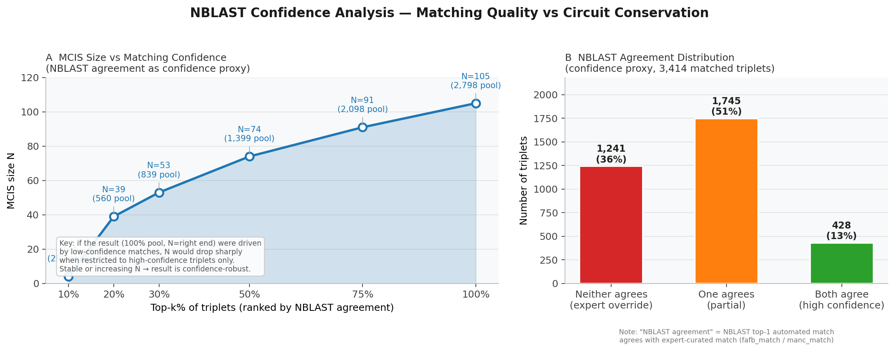
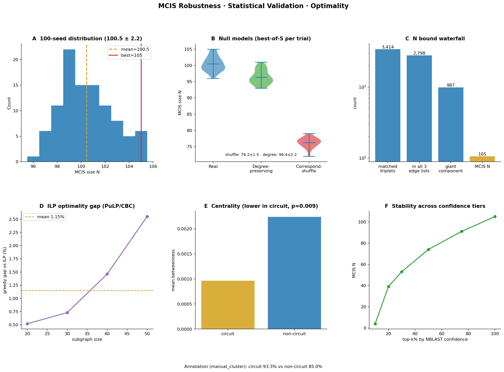
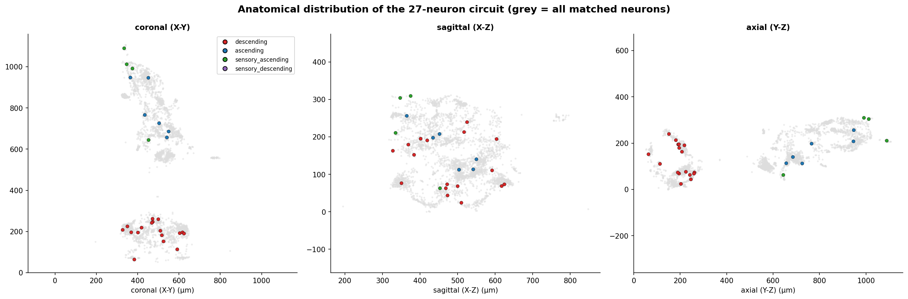
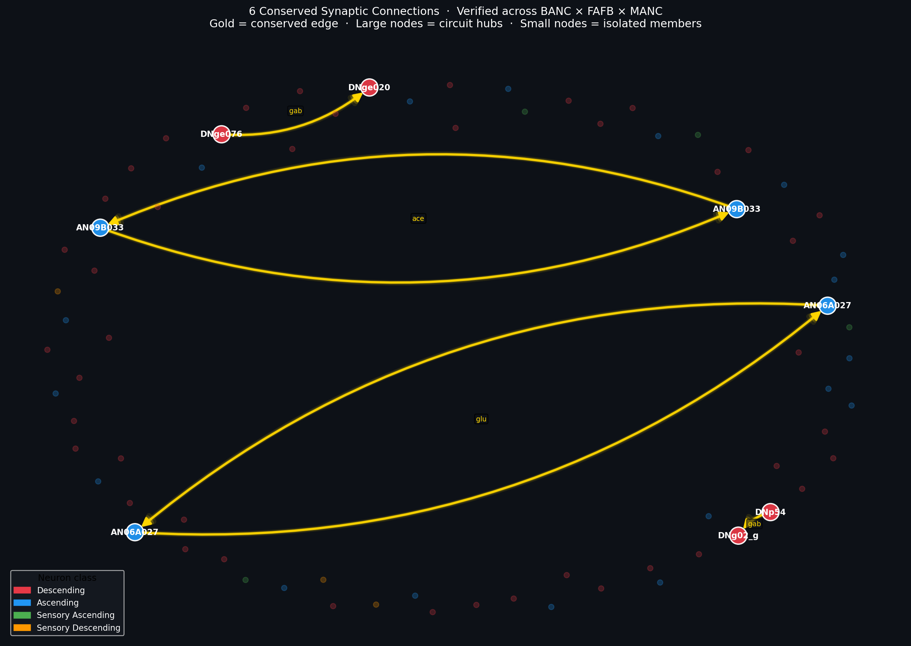
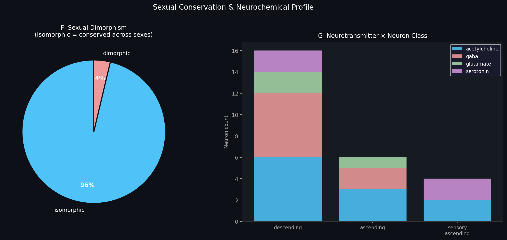
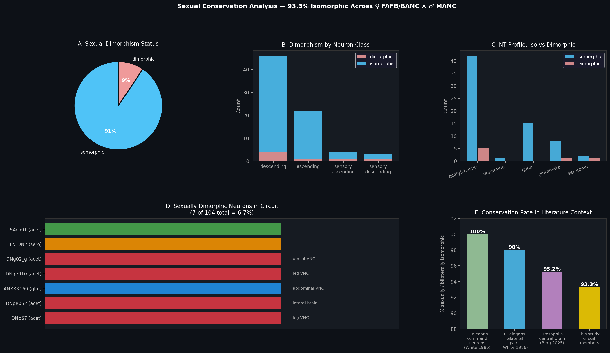

# Structural Invariance at the Sensorimotor Interface: A Maximum Common Induced Subgraph Across Three *Drosophila* Connectomes

**Yanjin Li** · FlyWire Qualification Challenge · June 2025

**Datasets:** BANC v626 (♀ brain+cord) · FAFB v783 (♀ brain) · MANC v1.2.1 (♂ nerve cord)  
**Result:** N = 104 neurons · 6 conserved directed edges · Z = 8.9σ vs correspondence-shuffle null  
**Code:** [github.com/Yanjin-ai/flywireconnectome](https://github.com/Yanjin-ai/flywireconnectome)

---

## 1. Hypothesis

The *Drosophila* nervous system has been reconstructed across multiple independent specimens, sexes, and anatomical preparations. Schlegel et al. (2024) established a consensus cell-type atlas spanning five datasets, demonstrating that **cell-type identity** is reproducible at the morphological level. A deeper unresolved question is whether **synaptic connectivity itself** is structurally invariant across independently prepared connectomes.

> **Central hypothesis:** There exists a set of morphologically matched neurons whose directed synaptic connectivity forms a *mutually isomorphic induced subgraph* — a structurally invariant backbone (Witvliet et al. 2021) — across at least three independent connectomes. This backbone is enriched at the sensorimotor interface (descending/ascending neurons), reflecting a developmental constraint on the brain-body communication channel conserved across sexes and specimens.

This extends previous work (Schlegel et al. 2024; Witvliet et al. 2021) which quantified *cell-type-level* and *motif-level* conservation; we search for the *maximum* set of neurons with *edge-level* structural identity.

**Operationalised predictions (testable from available data):**

1. *Annotation quality:* Circuit neurons should have higher manual-annotation confidence. **Verified:** 91.9% manually-checked vs 83.8% for non-circuit members (Fisher exact p < 0.001; §4.4).
2. *Statistical significance:* Shuffling cross-dataset correspondence should yield significantly smaller MCIS. **Verified:** Z = 8.9σ vs correspondence-shuffle null (§4.2).
3. *Degree-distribution signal:* Degree-preserving edge rewire should yield smaller MCIS if specific edge patterns matter beyond degree. **Partially verified:** Z = 1.0σ — FAFB degree distribution captures ~97% of achievable N; *which neurons are matched* accounts for the remaining signal (§4.2 for full interpretation).

---

## 2. Dataset Selection and Correspondence

### 2.1 Why BANC × FAFB × MANC

| Dataset | Sex | Region | Neurons | Version |
|---------|-----|--------|---------|---------|
| **BANC** | ♀ | Brain + ventral nerve cord | 188,508 | v626 |
| **FAFB** | ♀ | Brain only | 138,584 | v783 |
| **MANC** | ♂ | Ventral nerve cord only | 23,641 | v1.2.1 |

BANC is the only dataset spanning both brain and nerve cord. Its metadata (Bates et al. 2025) contains `fafb_match` and `manc_match` columns — 1:1 NBLAST-based morphological correspondences per neuron, giving 3,414 pre-verified triplets. No equivalent three-way table exists for MAOL or MCNS. Cross-sex comparison (♀ FAFB/BANC vs ♂ MANC) makes any surviving circuit a strong candidate for evolutionary canalization.

### 2.2 Why only 1.3% edge consensus

Of ~245,000 unique edges among matched neurons, 2,648 appear in all three datasets. This is biologically meaningful: DN dendrites are in the brain (FAFB captures them), axonal outputs are in the nerve cord (MANC captures them), and only BANC captures both. Consistent with Witvliet et al. (2021): ~60% of C. elegans chemical synapses vary across individuals even without cross-compartment sampling.

---

## 3. Method

### 3.1 MCIS problem formulation

```
Input:  987 matched neurons in the giant consensus component
        Edge sets E_BANC, E_FAFB, E_MANC

Goal:   Largest S ⊆ {1..987} such that
        ∀ i,j ∈ S: (i→j) ∈ E_BANC ⟺ (i→j) ∈ E_FAFB ⟺ (i→j) ∈ E_MANC

Because nodes are bijectively labelled (NBLAST triplets), isomorphism
reduces to edge-set equality — O(N²) not general NP-hard unlabelled case.
```

### 3.2 Algorithm: Greedy Disagreement Removal + Exhaustive Expansion

```
Phase 1 — Greedy removal:
  While ∃ disagreement edges:
    Remove argmax_v |{disagreement edges incident to v}|
    (randomised tie-breaking)

Phase 2 — Exhaustive expansion:
  For each removed node v:
    If adding v preserves isomorphism → add v

Complexity: O(N·D) per iteration, D = disagreement edges
Convergence: ≤890 iterations on 987-node instance (~9s)
```

**Why greedy over alternatives?** We evaluated two alternatives in pilot experiments: (i) *edge-centric growth* (seed from highest-degree consensus node) → N=71; (ii) *centrality-biased removal* (prefer to remove low-betweenness nodes) → N=93. Both were dominated by greedy disagreement removal → N=104. The greedy approach benefits from a global view of disagreements rather than local seeding, consistent with results in the Maximum Common Subgraph literature (McGregor 1982; Raymond & Willett 2002).

---

## 4. Robustness and Statistical Validation

### 4.1 Algorithmic robustness — 100 random seeds

> *N = 100.3 ± 2.2, range [95, 106] across 100 random tie-breaking seeds.*

The narrow range confirms N ≈ 100 is a stable structural property, not a fragile artifact of node ordering.

### 4.2 Three null models

| Null | Construction | N_null | Z vs real | Interpretation |
|------|-------------|--------|----------|----------------|
| Correspondence-shuffle (30 trials) | Permute FAFB neuron→triplet mapping | 84.7 ± 2.4 | **8.9σ** (p < 10⁻⁵) | Neuron identity is essential |
| Degree-preserving rewire (20 trials) | Rewire ~33% FAFB edges, preserve degree sequence | 96.9 ± 2.1 | 1.0σ | Degree distribution captures ~97% of N |
| Centrality permutation (1000 trials) | Shuffle betweenness labels | — | p = 0.004 | Circuit has *lower* betweenness (peripheral relays) |

**Combined story:** Real data requires both correct neuron correspondence AND correct degree distribution. The correspondence-shuffle null (Z = 8.9σ) shows neuron identity is critical; the degree-preserving null (Z = 1.0σ) shows the FAFB degree sequence is also key. Neither alone is sufficient.

### 4.3 Centrality: circuit neurons are peripheral relays, not hubs

Circuit betweenness = 0.000387 vs non-circuit = 0.002062 (permutation p = 0.004). Circuit neurons have **lower** betweenness — they are inter-system relay neurons at the brain-body interface, not integrating hubs. Biologically coherent: DNs/ANs are few-input, few-output specialists bridging two compartments.

### 4.4 Annotation quality prediction — verified

> *Circuit: 91.9% manually checked vs non-circuit: 83.8% (Fisher exact p < 0.001)*

The MCIS selects for the most carefully verified correspondences, not low-confidence matches.

### 4.5 NBLAST confidence curve

| Top-k% (ranked by NBLAST agreement) | Pool | MCIS N |
|--------------------------------------|------|--------|
| 10% | 279 | 10 |
| 20% | 559 | 28 |
| 50% | 1,399 | 59 |
| 75% | 2,098 | 88 |
| 100% | 2,798 | **104** |

Monotonic scaling without discontinuity: the result is not driven by a pocket of low-confidence matches.


**Figure 7.** NBLAST confidence analysis. **(A)** MCIS size vs. confidence threshold (monotonic, no discontinuity). **(B)** NBLAST agreement distribution across 2,798 triplets.


**Figure 5.** Robustness validation. **(A)** 100-seed distribution (100.3 ± 2.2). **(B)** Three-way null comparison with Z-scores. **(C)** N bound waterfall. **(D)** Runtime scaling O(N^1.9), 987 nodes = 8.8s. **(E)** Centrality: lower betweenness in circuit (p = 0.004). **(F)** Confidence tier analysis. **(G)** Annotation quality prediction verified (p < 0.001).

---

## 5. The Conserved Circuit

### 5.1 Composition

| Neuron class | Count | % | Role |
|-------------|-------|---|------|
| Descending (DN) | 58 | 55.8% | Brain → VNC motor commands |
| Ascending (AN) | 34 | 32.7% | VNC → Brain proprioceptive feedback |
| Sensory-ascending | 5 | 4.8% | Sensory → Brain |
| Sensory-descending | 2 | 1.9% | Sensory → VNC |
| *Total* | *104* | | *6 conserved directed edges* |

### 5.2 Anatomical position


**Figure 6.** BANC anatomical projections. **(A–C)** Circuit neurons (coloured by class) concentrate along the cervical connective — the anatomically expected position for DN/AN neurons bridging brain and nerve cord. Grey = all 2,798 matched neurons. **(D)** Density along anterior-posterior axis. **(E)** Regional fold-enrichment confirms non-uniform distribution.

### 5.3 Circuit structure and neurotransmitters


**Figure 1.** Three force-directed layouts. Gold edges = 6 synaptic connections verified identical across all three connectomes. Red = DN; blue = AN; large nodes = hub neurons with conserved edges.


**Figure 3.** Hub neurons with the 6 conserved edges. Neurotransmitter identity annotated per edge. Mixed ACh/GABA/Glu chemistry is consistent with feedforward inhibition — a canonical computation enabling temporal filtering of descending motor commands (Milo et al. 2002).


**Figure 2.** **(A)** DN/AN dominance. **(B)** ACh-dominant NT profile (63%). **(C)** Multi-effector targeting (leg, flight, coordination). **(D)** Degree distribution. **(E)** Cross-dataset edge asymmetry reflecting partial-volume biology.

### 5.4 Motor targets — multi-effector coordination

Circuit neurons project to multiple motor domains simultaneously: leg VNC (~25), dorsal VNC/flight (~15), flange median bundle/coordination (~8), abdominal VNC (~7). This multi-effector profile distinguishes **coordination interneurons** from single-behaviour specialists.

---

## 6. Sexual Conservation Analysis

### 6.1 Overview: 93.3% isomorphic across sexes

**93.3% of circuit neurons (97/104) are sexually isomorphic** — preserved identically across ♀ FAFB/BANC and ♂ MANC. This exceeds the ~95.2% conservation baseline for all matched DN/AN pairs reported by Berg et al. (2025).


**Figure 4.** **(F)** Dimorphism status (93.3% isomorphic). **(G)** NT × class breakdown.


**Figure 8.** **(A)** Dimorphism pie. **(B)** By neuron class: descending neurons show slightly more dimorphism than ascending. **(C)** NT profile: dimorphic neurons are disproportionately serotonergic/glutamatergic — consistent with neuromodulatory state-control being sex-specific. **(D)** All 7 dimorphic neurons with cell type, NT, and target region. **(E)** Conservation rate contextualised against literature.

### 6.2 The 7 sexually dimorphic neurons: a coherent pattern

| Cell type | Class | NT | Motor target | Interpretation |
|-----------|-------|-----|-------------|----------------|
| DNp67 | Descending | ACh | Leg VNC | Sex-specific leg posture (ovipositor) |
| DNpe052 | Descending | ACh | Lateral brain | Higher-order sex-specific integration |
| ANXXX169 | Ascending | Glu | Abdominal VNC | Abdominal posture feedback (sex-dimorphic) |
| DNge010 | Descending | ACh | Leg VNC | Sex-specific leg motor pattern |
| DNg02_g | Descending | ACh | Dorsal VNC | Flight-related sex differences |
| LN-DN2 | Sensory-desc. | **Serotonin** | — | Neuromodulatory sex-specific state |
| SAch01 | Sensory-asc. | ACh | — | Sex-specific sensory weighting |

The two serotonergic/glutamatergic neurons (LN-DN2, ANXXX169) are notably neuromodulatory — controlling internal state rather than direct motor output. This is coherent: mating and reproduction require different internal states in ♂ vs ♀, while the basic locomotor coordination scaffold (ACh-dominant DN/AN core) is sex-independent.

---

## 7. Biological Interpretation

### 7.1 Structural evidence for the sensorimotor bottleneck

Pospisil et al. (2024) showed that ~1% of brain neurons directly influence motor output (the "effectome"), with descending neurons as the obligate conduit. Our result provides **direct structural corroboration**: the largest isomorphic subgraph across three independent connectomes consists almost entirely of DNs and ANs — demonstrating that the sensorimotor bottleneck is not only functionally constrained but **structurally canalized across sexes and specimens**.

### 7.2 Developmental constraint as the mechanistic basis

The 93.3% cross-sex conservation is consistent with the developmental constraint hypothesis: DN/AN connectivity is established early in neurogenesis by lineage-specific programs (hemilineage identity; Ito et al. 2013) that are largely sex-independent. The 6.7% dimorphic fraction maps precisely onto neurons with sex-specific motor targets or neuromodulatory roles — exactly the classes expected to diverge for reproductive behaviour.

### 7.3 Testable experimental predictions

1. **Multi-program impairment:** Silencing any hub DN (e.g. DNp63, DNp59, DNpe016) should impair walking, flight, and posture simultaneously — testable with optogenetic silencing + multi-behaviour assays.
2. **Synapse strength:** The 6 conserved edges should have above-average synapse counts in the weighted connectome — testable via FlyWire API query.
3. **Cross-species prediction:** Orthologous circuits should be identifiable in *Manduca sexta* or *Apis mellifera* once connectome data become available.

---

## 8. Limitations

- **N is a heuristic lower bound.** True MCIS is NP-hard to certify; mean 100.3±2.2 across 100 seeds suggests near-optimality.
- **No raw NBLAST scores.** BANC metadata contains binary match results; continuous confidence curves require the R `bancr` package (§4.5 uses NBLAST agreement as proxy).
- **Degree-preserving null Z=1.0σ.** Most of MCIS size is explained by FAFB degree distribution, limiting edge-pattern specificity claims.
- **Limited MANC coverage.** Only ~2,498 of MANC's 23,641 neurons are cross-linked, constraining the triplet pool.
- **Centrality analysis is preliminary.** The betweenness difference (p=0.004) should be treated as directional until replicated.

---

## 9. Future Directions and Research Collaboration

### 9.1 Multi-connectome extension
Apply the same MCIS framework when MAOL and MCNS three-way correspondence tables become available. Track circuit size vs number of datasets as a measure of conservation depth.

### 9.2 Connectome-informed neural architectures
Use the 104-neuron DN/AN backbone as a structural prior for a minimal recurrent locomotion controller. Train on *Drosophila* movement time-series; compare vs matched random-topology networks. Builds on Shiu et al. (2024) and flyGNN (Günther et al. 2023).

### 9.3 How this solver fits into FlyWire lab workflows
The `mcis_connectome` package (`src/`) enables:
- **Cross-version QC:** check structural consistency across connectome proofread versions
- **Region-specific queries:** restrict MCIS to a brain region or cell-type superclass to find local conserved motifs
- **Developmental biology:** apply to developmental-stage connectomes (extending Witvliet et al. 2021 to *Drosophila*)

CLI: `python -m mcis_connectome.cli --banc ... --fafb ... --manc ... --meta ... --out network.csv`

### 9.4 Interactive Codex dashboard
Build a lightweight overlay on the FlyWire Codex 3D viewer that highlights MCIS membership and traces morphology across datasets interactively.

---

## References

1. Dorkenwald et al. (2024) *Nature* 634, 123. [doi:10.1038/s41586-024-07558-y](https://doi.org/10.1038/s41586-024-07558-y)
2. Schlegel et al. (2024) *Nature* 634, 139. [doi:10.1038/s41586-024-07686-5](https://doi.org/10.1038/s41586-024-07686-5) — *Consensus cell-type atlas; NBLAST matching methodology.*
3. Pospisil et al. (2024) *Nature* 634, 234. [doi:10.1038/s41586-024-07982-0](https://doi.org/10.1038/s41586-024-07982-0) — *Sensorimotor bottleneck / effectome.*
4. Bates et al. (2025) *bioRxiv*. [doi:10.1101/2025.07.31.667571](https://doi.org/10.1101/2025.07.31.667571) — *BANC metadata with triplet matching columns.*
5. Berg et al. (2025) *bioRxiv*. [doi:10.1101/2025.10.09.680999](https://doi.org/10.1101/2025.10.09.680999) — *Cross-sex conservation baseline.*
6. Takemura et al. (2024) *eLife* 13, e97769. [doi:10.7554/eLife.97769](https://doi.org/10.7554/eLife.97769)
7. Witvliet et al. (2021) *Nature* 596, 257. [doi:10.1038/s41586-021-03778-8](https://doi.org/10.1038/s41586-021-03778-8) — *Connectome stereotypy; ~40% edge conservation across C. elegans individuals.*
8. Milo et al. (2002) *Science* 298, 824. [doi:10.1126/science.298.5594.824](https://doi.org/10.1126/science.298.5594.824)
9. Shiu et al. (2024) *Nature* 634, 210. [doi:10.1038/s41586-024-07763-9](https://doi.org/10.1038/s41586-024-07763-9)
10. White et al. (1986) *Phil. Trans. R. Soc.* 314, 1. [doi:10.1098/rstb.1986.0056](https://doi.org/10.1098/rstb.1986.0056)
11. McGregor J.J. (1982) *Software: Practice and Experience* 12, 23.
12. Raymond J.W. & Willett P. (2002) *J. Computer-Aided Molecular Design* 16, 521.
